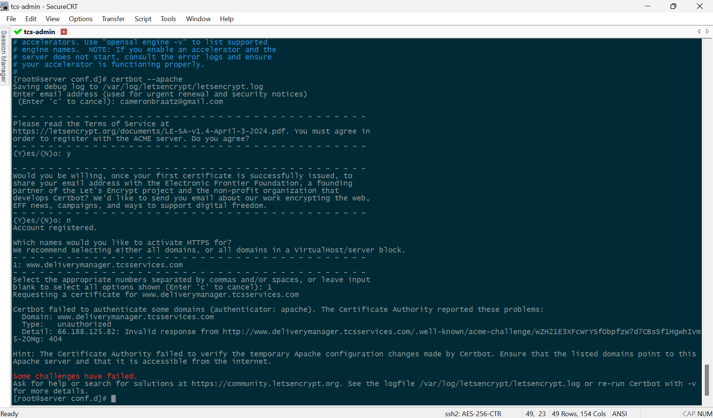

# Start-to-Finish Deployment Process
The below instructions lays out the process of establishing an Apache web server on a CentOS7 Linux server, on which a .NET Core 7 web application will be hosted perpetually as a service.

Whether or not the .NET application is developed yet, establishing the Apache web server is a good place to start.

# Establishing Apache Web Server on RHEL CentOS7
Step-by-step instructions to installing and running an Apache web server on home Linux server. The steps below follow this <a href="https://www.digitalocean.com/community/tutorials/how-to-install-the-apache-web-server-on-centos-7">DigitalOcean tutorial</a>.

***
### Prerequisites
The following requirements must be met before moving forward:
- **Non-root** user with sudo privileges configured on the server
- Domain name configured to point to the server
- Basic firewall configured on the server

The above requirements have additional resources for guidance at the link above, steps taken to establish Apache locally are recorded below. Once we get to the point of users and ownership, we will assume that our sudo-priveledged user already exists...in our case it is called **DM_USER**.

### Configuring Basic Firewall
CentOS7 comes with a native firewall called `firewalld`, within it `firewall-cmd` is used to configure firewall policies. This regulates permitting/denying traffic to every port on the server. (<a href="https://www.digitalocean.com/community/tutorials/additional-recommended-steps-for-new-centos-7-servers#configuring-a-basic-firewall">Documentation</a>)

As always, it is best practice to update libraries before installing a package:
```
sudo yum update
```

Install `firewalld`:
```
sudo yum install firewalld
```

The `firewalld` service can make modifications to permissions without affecting current connections, proceed to turn on the service.
```
sudo systemctl start firewalld
```

Now that the service is up and running, we need to set policy information for the firewall. The `firewalld` application uses 'zones' to label the trustworthiness of other hosts on the network. We need to first establish exceptions for approved services; for example, SSH is all important to maintain our access to the server.

If the SSH daemon is running on the default port, proceed as follows:
```
sudo firewall-cmd --permanent --add-service=ssh

sudo firewall-cmd --permanent --add-service=http

sudo firewall-cmd --permanent --add-service=https

sudo firewall-cmd --permanent --add-service=smtp
```
The additional services above open permissions for a HTTP web server, HTTPS web server with SSL/TLS enabled and SMTP email. You can see additional services to be enabled with:
```
sudo firewall-cmd --get-services
```
When you are finished, you can see the full list of exceptions to be implemented by listing all. If this all looks good, proceed to reload the service:
```
sudo firewall-cmd --permanent --list-all

sudo firewall-cmd --reload
```
If all goes well and testing is acceptable, enable to service to start at boot:
```
sudo systemctl enable firewalld
```
#### Configure Timezones
To configure timezones for your server, run the following:
```
sudo timedatectl list-timezones

sudo timedatectl set-timezone America/Denver
```
The first line lists all possible time zones, while the second assigns it. Running `sudo timedatectl` will confirm the current settings.

#### Configure NTP Synchronization
To ensure that our server stays synchronized with others, we can configure NTP synchronization. The following commands install, start and enable the service:
```
sudo yum install ntp

sudo systemctl start ntpd

sudo systemctl enable ntpd
```

### Creating a Swap File
Adding a 'swap' to the server allows it to move seldomly accessed information from a running program from RAM to some location on disk. While it is much slower to access information on disk, but this can be instrumental in preventing applications from failing...especially those hosting databases on the system.

**THESE STEPS WERE OMITTED ON LOCAL SETUP, RESEARCH IF THIS IS NEEDED ON TEST SERVER OR NOT**
```
sudo fallocate -l 4G /swapfile

sudo chmod 600 /swapfile

sudo mkswap /swapfile

sudo swapon /swapfile

sudo sh -c 'echo "/swapfile none swap sw 0 0" >> /etc/fstab'
```
***
## Step 1: Installing Apache
The Apache repository is available on CentOS defualt repositories and can be installed with:
```
sudo yum update httpd

sudo yum install httpd
```
If you have already established `firewalld` we need to open **port 80** to allow Apache to serve requests over HTTP, the same must be done for **port 443** if you plan to serve content over HTTPS. Add both services and reload the firewall service:
```
sudo firewall-cmd --permanent --add-service=http

sudo firewall-cmd --permanent --add-service=https

sudo firewall-cmd --reload
```
*Note: the above permissions should have already been added in establishing the firewall in previous steps...*

***
## Step 2: Checking the Web Server
Like other services, Apache will not start automatically upon installation. We will start the service manually for the first time with:
```
sudo systemctl start httpd

sudo systemctl status httpd
```
Successful start up will result in the following message:
```
● httpd.service - The Apache HTTP Server
   Loaded: loaded (/usr/lib/systemd/system/httpd.service; disabled; vendor preset: disabled)
   Active: active (running) since Tue 2024-06-04 14:40:21 MDT; 9s ago
     Docs: man:httpd(8)
           man:apachectl(8)
 Main PID: 23043 (httpd)
   Status: "Total requests: 0; Current requests/sec: 0; Current traffic:   0 B/sec"
   CGroup: /system.slice/httpd.service
           ├─23043 /usr/sbin/httpd -DFOREGROUND
           ├─23044 /usr/sbin/httpd -DFOREGROUND
           ├─23045 /usr/sbin/httpd -DFOREGROUND
           ├─23046 /usr/sbin/httpd -DFOREGROUND
           ├─23047 /usr/sbin/httpd -DFOREGROUND
           └─23048 /usr/sbin/httpd -DFOREGROUND
...
```
At this point, Apache is up and running and can be tested by visiting your server's IP address. By calling `hostname -I` you can see what network addresses are available, once you navigate to this address on your browser the following page should be served.


***
## Step 3: Managing the Apache Process
Now that the web server is up and running, the commands below outline some basic functionality:
```
// stop the web server...
sudo systemctl stop httpd

// start the web server...
sudo systemctl start httpd

// stop then start the web server (restart)...
sudo systemctl restart httpd

// restart without dropping connections...
sudo systemctl reload httpd

// prevent starting at runtime...
sudo systemctl disable httpd

// enable starting at runtime (default)...
sudo systemctl enable httpd
```

***
## Step 4: Setting Up Virtual Hosts (Best to Come Back After Application is Copied to Server)
The default Apache configuration enables the server to host a single website, if more than one domain will be hosted on the server it will be necessary to configure virtual hosts.

The following steps will establish a domain, `deliverymanager.tcsservices.com:40730`, on the server. By default, Apache on CentOS7 enables one server block to serve documents from at `/var/www/html`. Hosting multiple sites in this directory can be unwieldy, so instead we will create a directory structure within `/var/www` for each domain. This leaves the `/var/www/html` directory in place as the default directory if a request doesn't match any other sites.

Create the `html` and `log` directories, using the `-p` flag ensures creation of any necessary parent directories:
```
sudo mkdir -p /var/www/deliverymanager/html

sudo mkdir -p /var/www/deliverymanager/log
```

Next, ensure proper ownership of the `html` directory with the `$USER` (uses current user, else explicitly define user) environmental variable and set the permissions to default:
```
sudo chown -R $USER:$USER /var/www/deliverymanager/html

sudo chmod -R 755 /var/www
```

Using **vim** we will create a sample `index.html` file to test our VM with:
```
sudo vim /var/www/deliverymanager/html/index.html
```

With the site directory and index files in place, we need to create a `sites-available` directory to store our virtual hosts. We will also create a `sites-enabled` directory that tells Apache that a particular virtual host is ready to be served.

The latter directory will hold symbolic links to virtual hosts we want to publish, create both directories with:
```
sudo mkdir /etc/httpd/sites-available /etc/httpd/sites-enabled
```

Once created, we will edit the Apache config file, `httpd.conf`, to inform Apache to look for virtual hosts in the `sites-enabled` directory. Open the config file with:
```
sudo vim /etc/httpd/conf/httpd.conf
```
Add `IncludeOptional sites-enabled/*.conf` to the end of the file, save and close the file. 

Next, create a new config file in `sites-available` with `sudo vim /etc/httpd/sites-available/deliverymanager.conf` and place the following config block inside:
```
<VirtualHost *:*>
    RequestHeader set "X-Forwarded-Proto" expr=%{REQUEST_SCHEME}s
</VirtualHost>

<VirtualHost *:80>
    ProxyPreserveHost On
    ProxyPass / http://127.0.0.1:5000/
    ProxyPassReverse / http://127.0.0.1:5000/
    ServerName www.tcsservices.com:40730
    ServerAlias *.tcsservices.com:40730
    DocumentRoot /var/www/deliverymanager
    ErrorLog /var/www/deliverymanager/log/error.log
    CustomLog /var/www/deliverymanager/log/requests.log combined
</VirtualHost>
```

Once created we need to enable them so that Apache can serve them. We need to create a symbolic link for each virtual host in the `sites-enabled` directory with:
```
sudo ln -s /etc/httpd/sites-available/deliverymanager.conf /etc/httpd/sites-enabled/deliverymanager.conf
```
***
## Step 5: Adjusting SELinux Permissions for Virtual Hosts (Recommended)
Before restarting Apache, we want to be sure that SELinux has the correct policies in place for our new virtual host. SELinux is configured to work with the default Apache configuration, but since we set up a custom log directory in the virtual host config this will return an error on start up.

Apache needs be allowed to write to the necessary files, but disabling SELinux altogether is not a good idea as it brings with it a good amount of security. You can adjust SELinux universally as well as on a single directory, the latter is much more secure and thus is the recommended approach.

#### Adjusting Apache Policies Universally
Setting the Apache policy universally tells the SELinux to treat all Apache processes identically. While more convenient, we sacrifice the level of control that otherwise would be focused on particular files and/or directories.

Run the following command to set a universal Apache policy:
```
sudo setsebool -P httpd_unified 1
```
The `setsebool` command changes SELinux boolean values, the `-P` flag updates the boot-time value making this change persist across reboots, and the `httpd_unified` is the boolean telling SELinux to treat all Apache processes as the same (with a value of `1`).

#### Adjusting Apache Policies on a Directory
While this approach provides more control over our Apache processes, it also requires more maintenance. Since it is not universal, we need to be sure to manually set the context type for any new log directories specified in our viertual host configurations.

Begin by checking the context type that SELinux gave the new directory:
```
sudo ls -dZ /var/www/deliverymanager/log/
```
This will list and print the SELinux context of the directory, specifically the current context is defined as `httpd_sys_content_t` (read only). We will want to change it to `httpd_log_t` to allow Apache to generate and append web app log files and apply the changes to persist across reboots:
```
sudo semanage fcontext -a -t httpd_log_t "/var/www/deliverymanager/log(/.*)?"

sudo restorecon -R -v /var/www/deliverymanager/log
```
The `-R` flag runs the command recursively, updating all existing files to use the new context. The `-v` flag will print the context changes the command made. You can check the context with the aforementioned command to ensure the changes stuck.

***
# Deploying .NET Core 7 Application to Host Server
Step-by-step documentation of first attempt at deployment of .NET CORE driver manifest application to CENTOS7. 
***
## Prerequisites
Preparation of the CENTOS7 Linux server prior to hosting/deployment of .NET CORE application.

### Update **yum** Packages
This should be performed prior to attempting to download any package.<br>

```sudo yum update```

### Install .NET SDK
The .NET SDK allows you to develop apps with .NET. If the SDK is installed, the corresponding runtimes should automatically be downloaded.

```sudo yum install dotnet-sdk-7.0```

### Verify Installation Package
Verify the respective packages have been installed correctly.

```
sudo dotnet --info
ll /usr/share/dotnet/sdk
```

### Install Mod_SSL/Mod_Rewrite
The .NET SDK allows you to develop apps with .NET. If the SDK is installed, the corresponding runtimes should automatically be downloaded.

```sudo yum install mod_ssl```

```sudo yum install mod_rewrite```

### Publish Application
From Visual Studio, *Build -> Publish DriverChecklist*. Choose location to publish to ```C:\publish\driverChecklist\240427``` and ensure that the target runtime is set to *linux-x64*. 

Sounds like running the following command is also viable:

```dotnet publish --configuration Release```

### Publish Project to .NET7.0 with CLI
The steps above using the VS GUI produces a deployment package in the latest version of .NET (8.0), rather we can specify that we deploy to .NET7.0 using the CLI on the Linux server by running the following commands from the project directory (DeliveryChecklist/api/DeliveryChecklist):

```dotnet publish DeliveryChecklist -f net7.0 -c Release```

Which should publish to: 
```
  DriverChecklist -> C:\Users\camer\Desktop\Apps\DeliveryChecklist\api\DeliveryChecklist\DriverChecklist\bin\Release\net7.0\DriverChecklist.dll
  DriverChecklist -> C:\Users\camer\Desktop\Apps\DeliveryChecklist\api\DeliveryChecklist\DriverChecklist\bin\Release\net7.0\publish\
```

After uploading the resulting files to the server, restart and enable httpd on the apache server. Enable and start the *kestrel-deliverymanifest.service* before checking its status.

**Alternatively:** Use the GUI approach from Visual Studio for easy-to-navigate options to ensure the requirements are met above.

The current working version used the latter approach, replacing existing files with the latest deployment files and storing them in `C:/Users/camer/Desktop/Apps/DeliveryManager/DeliveryManager.Server/bin/Release/net7.0/publish/`. The files are relocated to the server to replace the existing ones.

### Copy Application to Server
FTP the published files to the server, it is suggested to store them at *var/www/deliverymanager*.

### Configure Proxy Server (refer to Apache setup above...)
Refer to https://learn.microsoft.com/en-us/aspnet/core/host-and-deploy/linux-apache?view=aspnetcore-8.0, none of the steps were followed as the config file could not be found.

### Configure Apache (refer to Apache setup above...)
Config files for Apache are stored in */etc/httpd/conf.d/* directory. In Apache on Ubuntu, all the virtual host config files are stored in */etc/apache2/sites-available*. Any file with the *.conf* extension is processed in alphabetical order in addition to the module configuration files in */etc/httpd/conf.modules.d*, which contains any configuration files necessary to load modules.

Create a configuration file, named *project_name.conf*, for the app:
```
<VirtualHost *:*>
    RequestHeader set "X-Forwarded-Proto" expr=%{REQUEST_SCHEME}s
</VirtualHost>

<VirtualHost *:80>
    ProxyPreserveHost On
    ProxyPass / http://127.0.0.1:5000/
    ProxyPassReverse / http://127.0.0.1:5000/
    ServerName www.tcsservices.com:40730
    ServerAlias *.tcsservices.com:40730
    DocumentRoot /var/www/deliverymanager
    ErrorLog /var/www/deliverymanager/log/error.log
    CustomLog /var/www/deliverymanager/log/requests.log combined
</VirtualHost>
```
Verify proper syntax by running ```apachectl configtest``` and restart Apache:
```
sudo systemctl restart httpd
sudo systemctl enable httpd
```

## Monitor the Application
Apache is now set up to forward requests made to *http://localhost:80* to the ASP.NET Core app running on Kestrel at *http://127.0.0.1:5000*. Though, Apache isn't set up to manage the Kestrel process.

Use *systemd* and create a service file to start and monitor the underlying web app. *systemd* is an init system that provides many powerful features for starting, stopping, and managing processes.

### Create the Service File
Create service definition file:

```sudo nano /etc/systemd/system/kestrel-deliverymanager.service```

```
[Unit]
Description=Example .NET Web API App running on CentOS 7

[Service]
WorkingDirectory=/var/www/deliverymanager
ExecStart=/usr/share/dotnet/dotnet /var/www/deliverymanager/DeliveryManager.Server.dll
Restart=always
# Restart service after 10 seconds if the dotnet service crashes:
RestartSec=10
KillSignal=SIGINT

StandardOutput=syslog
StandardError=syslog
SyslogIdentifier=dotnet-DM

#User=apache
User=DM_User
Environment=ASPNETCORE_ENVIRONMENT=Production 
Environment=DOTNET_CLI_HOME=/tmp

[Install]
WantedBy=multi-user.target
```

```
[Unit]
Description=Example .NET Web API App running on CentOS 7

[Service]
WorkingDirectory=/var/www/deliverymanager
ExecStart=/usr/share/dotnet/dotnet /var/www/deliverymanager/DeliveryManager.Server.dll
Restart=always
# Restart service after 10 seconds if the dotnet service crashes:
RestartSec=10
KillSignal=SIGINT

StandardOutput=syslog
StandardError=syslog
SyslogIdentifier=dotnet-DM

#User=apache
User=DM_User
Environment=ASPNETCORE_ENVIRONMENT=Production
Environment=DOTNET_CLI_HOME=/tmp

[Install]
WantedBy=multi-user.target
```

Use *TimeoutStopSet* to configure the duration of time to wait for the app to shut down after it receives the intial interrupt signal. If the app doesn't shut down in this period, SIGKILL is issued to terminate the app. If nothing is specified, it defaults to the value *DefaultTimeoutStopSec* in the manager configuration file (systemd-system.conf, system.conf.d, systemd-user.conf, user.conf.d). Most defaults are set for 90 seconds.

**Note:** The preceding example used *DM_User* as the specified User, this user must exist and have proper ownership over the app's files.

#### Create ```DM_User``` User on Linux
Create *DM_User* user and ensure ownership/priveledges to the project directory to the user.
```
adduser DM_User
passwd DM_User
usermod -aG DM_User DM_User
chown -R DM_User:DM_User /var/www/html
systemctl restart httpd
```

### Establish SQL Connection String (unsure on this...)
Some values, including SQL connection strings must be escaped for the configuration providers to read the environment variables. Use the following command to generate a properly escaped value for use in the configuration file:<br>
```
systemd-escape "ConnectionStrings_DefaultConnection"
#Environment=ConnectionStrings__DefaultConnection={"/opt/mssql-tools/bin/sqlcmd -U SA -P Sql2023! -S 192.168.1.33,1433 -d TCSWEB"}
export ConnectionStrings__DefaultConnection="/opt/mssql-tools/bin/sqlcmd -U SA -P Sql2023! -S 192.168.1.33,1433 -d TCSWEB"
```
This *may* need to be reworked to ensure this environment variable persists...

### Enable and Start Service
Save the file/variables and enable the service.

```systemctl enable kestrel-deliverymanifest.service```

Start the service and verify that it is running:
```
sudo systemctl start kestrel-deliverymanifest.service
sudo systemctl status kestrel-deliverymanifest.service
```

## Enable React in .NET Deployment
This may or may not be necessary if you begin with creating a "React and ASP.NET Core" project template. Ensure that these are necessary before proceeding...

First we need to assemble the React build files by running,
```npm run build``

Refer to this StackOverflow post for tips for integrating static files, https://stackoverflow.com/questions/75180838/deploy-asp-net-core-7-web-api-with-react-front-end.

Refer to the latest repository for the working Program.cs file.

# Configure Application for Hosting on Sub-Domain
The above directions work to establish and host an application on a Linux server at an established URL. Though, we are hoping to host this on its own dedicated sub-domain.

The service file does not have any domain specific code in it and should not need to be changed.

### Update the Reverse Proxy File
Update the `ServerName` and `ServerAlias` to reflect the new sub-domain.
```
# /etc/httpd/sites-available/deliverymanager.conf
#
<VirtualHost *:*>
    RequestHeader set "X-Forwarded-Proto" expr=%{REQUEST_SCHEME}s
</VirtualHost>

<VirtualHost *:80>
    ProxyPreserveHost On
    ProxyPass / http://127.0.0.1:5000/
    ProxyPassReverse / http://127.0.0.1:5000/
    ServerName www.deliverymanager.tcsservices.com:40730
    ServerAlias *.deliverymanager.tcsservices.com:40730
    
    DocumentRoot /var/www/deliverymanager
    ErrorLog /var/www/deliverymanager/log/error.log
    CustomLog /var/www/deliverymanager/log/requests.log combined
</VirtualHost>
```

### Update the Program.cs File
Add the additional origin domains to the list of allowed origins, the previous domains may be removed once the sub-domains are successfully implemented.
```
builder.Services.AddCors(options => {
    options.AddPolicy(name: MyAllowSpecificOrigins,
        policy => {
            policy.WithOrigins("http://www.tcsservices.com:40730", 
                                "www.tcsservices.com:40730", 
                                "tcsservices.com/40730",
                                "http://www.deliverymanager.tcsservices.com:40730",
                                "www.deliverymanager.tcsservices.com:40730",
                                "deliverymanager.tcsservices.com:40730")
                                .AllowAnyHeader()
                                .AllowAnyMethod();
        });
});
```

### Update the API URL Strings
Revise the API strings used from the frontend for it's API calls. In each React component/page file, be sure to change the base API URL to be:

`const API_URL = "http://www.deliverymanager.tcsservices.com:40730/"`

### Redeploy Application to the Server
Deploy the updated application files to the server, restart both Apache and application service files to reflect latest and greatest versions.

If the service file is not restarted at this point, the API will likely fail due to outdated backend logic. The error will appear

***
# Configure HTTPS on Apache Server
The following steps are documentation for the procurement of a valid certificate-authority SSL certificate for free. The CA is <a href="https://letsencrypt.org/">https://letsencrypt.org/</a> and directs us to <a href="https://certbot.eff.org/">https://certbot.eff.org/</a> to use the Certbot ACME client. Note: this particular process needs Shell access to work.

### SSH into the Host Server
SSH into the server running the HTTP website, ensuring that you are logged in as a user with sudo priveleges. This instance will be attempted using the root user.

## Install *snapd*
The necessary *snapd* packages are found in the *epel-release* repository and can be downloaded using:

`yum install epel-release`

Once the latest epel-release is installed, proceed with installing *snapd*:

`yum install snapd`

Once installed, the *systemd* unit that manages the main snap communication socket needs to be enabled:

`systemctl enable --now snapd.socket`

Classic snap support is enabled by creating a symbolic link between `/var/lib/snapd/snap` and `/snap`:

`ln -s /var/lib/snapd/snap /snap`

#### Restart Linux System
To finish configuring *snapd*, be sure to log out and log back in or restart the system before proceeding. A simple log in/log out was not sufficient in first attempt, `systemctl restart httpd` was though.

## Install Certbot
Prior to installing certbot, ensure that no previous installations of certbot are installed. 

`yum remove certbot`

Install certbot onto the system:

`snap install --classic certbot`

## Prepare Certbot Command
The following instruction should be executed to ensure that the `certbot` command can be run:

`ln -s /snap/bin/certbot /usr/bin/certbot`

## Choose How to Run Certbot
#### Get and Install Certificates
Automated update procedure that *should* reconfigure Apache to enable HTTPS access in a single step

`certbot --apache`

#### Just Get Certificate
This provides only the certificate and leaves the apache configuration up to you, this was not attempted in the first pass:

`certbot certonly --apache`

## Error Message
The following error occurred during the first attempt at using `certbot --apache`.



## Backup Copies of Apache Config Files
`httpd.conf`
```
#
# This is the main Apache HTTP server configuration file.  It contains the
# configuration directives that give the server its instructions.
# See <URL:http://httpd.apache.org/docs/2.4/> for detailed information.
# In particular, see 
# <URL:http://httpd.apache.org/docs/2.4/mod/directives.html>
# for a discussion of each configuration directive.
#
# Do NOT simply read the instructions in here without understanding
# what they do.  They're here only as hints or reminders.  If you are unsure
# consult the online docs. You have been warned.  
#
# Configuration and logfile names: If the filenames you specify for many
# of the server's control files begin with "/" (or "drive:/" for Win32), the
# server will use that explicit path.  If the filenames do *not* begin
# with "/", the value of ServerRoot is prepended -- so 'log/access_log'
# with ServerRoot set to '/www' will be interpreted by the
# server as '/www/log/access_log', where as '/log/access_log' will be
# interpreted as '/log/access_log'.

#
# ServerRoot: The top of the directory tree under which the server's
# configuration, error, and log files are kept.
#
# Do not add a slash at the end of the directory path.  If you point
# ServerRoot at a non-local disk, be sure to specify a local disk on the
# Mutex directive, if file-based mutexes are used.  If you wish to share the
# same ServerRoot for multiple httpd daemons, you will need to change at
# least PidFile.
#
ServerRoot "/etc/httpd"

#
# Listen: Allows you to bind Apache to specific IP addresses and/or
# ports, instead of the default. See also the <VirtualHost>
# directive.
#
# Change this to Listen on specific IP addresses as shown below to 
# prevent Apache from glomming onto all bound IP addresses.
#
#Listen 12.34.56.78:80
Listen 80

#
# Dynamic Shared Object (DSO) Support
#
# To be able to use the functionality of a module which was built as a DSO you
# have to place corresponding `LoadModule' lines at this location so the
# directives contained in it are actually available _before_ they are used.
# Statically compiled modules (those listed by `httpd -l') do not need
# to be loaded here.
#
# Example:
# LoadModule foo_module modules/mod_foo.so
#
Include conf.modules.d/*.conf

#
# If you wish httpd to run as a different user or group, you must run
# httpd as root initially and it will switch.  
#
# User/Group: The name (or #number) of the user/group to run httpd as.
# It is usually good practice to create a dedicated user and group for
# running httpd, as with most system services.
#
User apache
Group apache

# 'Main' server configuration
#
# The directives in this section set up the values used by the 'main'
# server, which responds to any requests that aren't handled by a
# <VirtualHost> definition.  These values also provide defaults for
# any <VirtualHost> containers you may define later in the file.
#
# All of these directives may appear inside <VirtualHost> containers,
# in which case these default settings will be overridden for the
# virtual host being defined.
#

#
# ServerAdmin: Your address, where problems with the server should be
# e-mailed.  This address appears on some server-generated pages, such
# as error documents.  e.g. admin@your-domain.com
#
ServerAdmin root@localhost

#
# ServerName gives the name and port that the server uses to identify itself.
# This can often be determined automatically, but we recommend you specify
# it explicitly to prevent problems during startup.
#
# If your host doesn't have a registered DNS name, enter its IP address here.
#
#ServerName www.example.com:80

#
# Deny access to the entirety of your server's filesystem. You must
# explicitly permit access to web content directories in other 
# <Directory> blocks below.
#
<Directory />
    AllowOverride none
    Require all denied
</Directory>

#
# Note that from this point forward you must specifically allow
# particular features to be enabled - so if something's not working as
# you might expect, make sure that you have specifically enabled it
# below.
#

#
# DocumentRoot: The directory out of which you will serve your
# documents. By default, all requests are taken from this directory, but
# symbolic links and aliases may be used to point to other locations.
#
DocumentRoot "/var/www/html"

#
# Relax access to content within /var/www.
#
<Directory "/var/www">
    AllowOverride None
    # Allow open access:
    Require all granted
</Directory>

# Further relax access to the default document root:
<Directory "/var/www/html">
    #
    # Possible values for the Options directive are "None", "All",
    # or any combination of:
    #   Indexes Includes FollowSymLinks SymLinksifOwnerMatch ExecCGI MultiViews
    #
    # Note that "MultiViews" must be named *explicitly* --- "Options All"
    # doesn't give it to you.
    #
    # The Options directive is both complicated and important.  Please see
    # http://httpd.apache.org/docs/2.4/mod/core.html#options
    # for more information.
    #
    Options Indexes FollowSymLinks

    #
    # AllowOverride controls what directives may be placed in .htaccess files.
    # It can be "All", "None", or any combination of the keywords:
    #   Options FileInfo AuthConfig Limit
    #
    AllowOverride None

    #
    # Controls who can get stuff from this server.
    #
    Require all granted
</Directory>

#
# DirectoryIndex: sets the file that Apache will serve if a directory
# is requested.
#
<IfModule dir_module>
    DirectoryIndex index.html
</IfModule>

#
# The following lines prevent .htaccess and .htpasswd files from being 
# viewed by Web clients. 
#
<Files ".ht*">
    Require all denied
</Files>

#
# ErrorLog: The location of the error log file.
# If you do not specify an ErrorLog directive within a <VirtualHost>
# container, error messages relating to that virtual host will be
# logged here.  If you *do* define an error logfile for a <VirtualHost>
# container, that host's errors will be logged there and not here.
#
ErrorLog "logs/error_log"

#
# LogLevel: Control the number of messages logged to the error_log.
# Possible values include: debug, info, notice, warn, error, crit,
# alert, emerg.
#
LogLevel debug

<IfModule log_config_module>
    #
    # The following directives define some format nicknames for use with
    # a CustomLog directive (see below).
    #
    LogFormat "%h %l %u %t \"%r\" %>s %b \"%{Referer}i\" \"%{User-Agent}i\"" combined
    LogFormat "%h %l %u %t \"%r\" %>s %b" common

    <IfModule logio_module>
      # You need to enable mod_logio.c to use %I and %O
      LogFormat "%h %l %u %t \"%r\" %>s %b \"%{Referer}i\" \"%{User-Agent}i\" %I %O" combinedio
    </IfModule>

    #
    # The location and format of the access logfile (Common Logfile Format).
    # If you do not define any access logfiles within a <VirtualHost>
    # container, they will be logged here.  Contrariwise, if you *do*
    # define per-<VirtualHost> access logfiles, transactions will be
    # logged therein and *not* in this file.
    #
    #CustomLog "logs/access_log" common

    #
    # If you prefer a logfile with access, agent, and referer information
    # (Combined Logfile Format) you can use the following directive.
    #
    CustomLog "logs/access_log" combined
</IfModule>

<IfModule alias_module>
    #
    # Redirect: Allows you to tell clients about documents that used to 
    # exist in your server's namespace, but do not anymore. The client 
    # will make a new request for the document at its new location.
    # Example:
    # Redirect permanent /foo http://www.example.com/bar

    #
    # Alias: Maps web paths into filesystem paths and is used to
    # access content that does not live under the DocumentRoot.
    # Example:
    # Alias /webpath /full/filesystem/path
    #
    # If you include a trailing / on /webpath then the server will
    # require it to be present in the URL.  You will also likely
    # need to provide a <Directory> section to allow access to
    # the filesystem path.

    #
    # ScriptAlias: This controls which directories contain server scripts. 
    # ScriptAliases are essentially the same as Aliases, except that
    # documents in the target directory are treated as applications and
    # run by the server when requested rather than as documents sent to the
    # client.  The same rules about trailing "/" apply to ScriptAlias
    # directives as to Alias.
    #
    ScriptAlias /cgi-bin/ "/var/www/cgi-bin/"

</IfModule>

#
# "/var/www/cgi-bin" should be changed to whatever your ScriptAliased
# CGI directory exists, if you have that configured.
#
<Directory "/var/www/cgi-bin">
    AllowOverride None
    Options None
    Require all granted
</Directory>

<IfModule mime_module>
    #
    # TypesConfig points to the file containing the list of mappings from
    # filename extension to MIME-type.
    #
    TypesConfig /etc/mime.types

    #
    # AddType allows you to add to or override the MIME configuration
    # file specified in TypesConfig for specific file types.
    #
    #AddType application/x-gzip .tgz
    #
    # AddEncoding allows you to have certain browsers uncompress
    # information on the fly. Note: Not all browsers support this.
    #
    #AddEncoding x-compress .Z
    #AddEncoding x-gzip .gz .tgz
    #
    # If the AddEncoding directives above are commented-out, then you
    # probably should define those extensions to indicate media types:
    #
    AddType application/x-compress .Z
    AddType application/x-gzip .gz .tgz

    #
    # AddHandler allows you to map certain file extensions to "handlers":
    # actions unrelated to filetype. These can be either built into the server
    # or added with the Action directive (see below)
    #
    # To use CGI scripts outside of ScriptAliased directories:
    # (You will also need to add "ExecCGI" to the "Options" directive.)
    #
    #AddHandler cgi-script .cgi

    # For type maps (negotiated resources):
    #AddHandler type-map var

    #
    # Filters allow you to process content before it is sent to the client.
    #
    # To parse .shtml files for server-side includes (SSI):
    # (You will also need to add "Includes" to the "Options" directive.)
    #
    AddType text/html .shtml
    AddOutputFilter INCLUDES .shtml
</IfModule>

#
# Specify a default charset for all content served; this enables
# interpretation of all content as UTF-8 by default.  To use the 
# default browser choice (ISO-8859-1), or to allow the META tags
# in HTML content to override this choice, comment out this
# directive:
#
AddDefaultCharset UTF-8

<IfModule mime_magic_module>
    #
    # The mod_mime_magic module allows the server to use various hints from the
    # contents of the file itself to determine its type.  The MIMEMagicFile
    # directive tells the module where the hint definitions are located.
    #
    MIMEMagicFile conf/magic
</IfModule>

#
# Customizable error responses come in three flavors:
# 1) plain text 2) local redirects 3) external redirects
#
# Some examples:
#ErrorDocument 500 "The server made a boo boo."
#ErrorDocument 404 /missing.html
#ErrorDocument 404 "/cgi-bin/missing_handler.pl"
#ErrorDocument 402 http://www.example.com/subscription_info.html
#

#
# EnableMMAP and EnableSendfile: On systems that support it, 
# memory-mapping or the sendfile syscall may be used to deliver
# files.  This usually improves server performance, but must
# be turned off when serving from networked-mounted 
# filesystems or if support for these functions is otherwise
# broken on your system.
# Defaults if commented: EnableMMAP On, EnableSendfile Off
#
#EnableMMAP off
EnableSendfile on

# Supplemental configuration
#
# Load config files in the "/etc/httpd/conf.d" directory, if any.
IncludeOptional conf.d/*.conf
IncludeOptional sites-enabled/*.conf

#LoadModule headers_module /modules/mod_headers.so
```

`ssl.conf`
```
#
# Listen: Allows you to bind Apache to specific IP addresses and/or
# ports, instead of the default. See also the <VirtualHost>
# directive.
#
# Change this to Listen on specific IP addresses as shown below to 
# prevent Apache from glomming onto all bound IP addresses.
#
#Listen 12.34.56.78:80
Listen 80

#
# Dynamic Shared Object (DSO) Support
#
# To be able to use the functionality of a module which was built as a DSO you
# have to place corresponding `LoadModule' lines at this location so the
# directives contained in it are actually available _before_ they are used.
# Statically compiled modules (those listed by `httpd -l') do not need
# to be loaded here.
#
# Example:
# LoadModule foo_module modules/mod_foo.so
#
Include conf.modules.d/*.conf

#
# If you wish httpd to run as a different user or group, you must run
# httpd as root initially and it will switch.  
#
# User/Group: The name (or #number) of the user/group to run httpd as.
# It is usually good practice to create a dedicated user and group for
# running httpd, as with most system services.
#
User apache
Group apache

# 'Main' server configuration
#
# The directives in this section set up the values used by the 'main'
# server, which responds to any requests that aren't handled by a
# <VirtualHost> definition.  These values also provide defaults for
# any <VirtualHost> containers you may define later in the file.
#
# All of these directives may appear inside <VirtualHost> containers,
# in which case these default settings will be overridden for the
# virtual host being defined.
#

#
# ServerAdmin: Your address, where problems with the server should be
# e-mailed.  This address appears on some server-generated pages, such
# as error documents.  e.g. admin@your-domain.com
#
ServerAdmin root@localhost

#
# ServerName gives the name and port that the server uses to identify itself.
# This can often be determined automatically, but we recommend you specify
# it explicitly to prevent problems during startup.
#
# If your host doesn't have a registered DNS name, enter its IP address here.
#
#ServerName www.example.com:80

#
# Deny access to the entirety of your server's filesystem. You must
# explicitly permit access to web content directories in other 
# <Directory> blocks below.
#
<Directory />
    AllowOverride none
    Require all denied
</Directory>

#
# Note that from this point forward you must specifically allow
# particular features to be enabled - so if something's not working as
# you might expect, make sure that you have specifically enabled it
# below.
#

#
# DocumentRoot: The directory out of which you will serve your
# documents. By default, all requests are taken from this directory, but
# symbolic links and aliases may be used to point to other locations.
#
DocumentRoot "/var/www/html"

#
# Relax access to content within /var/www.
#
<Directory "/var/www">
    AllowOverride None
    # Allow open access:
    Require all granted
</Directory>

# Further relax access to the default document root:
<Directory "/var/www/html">
    #
    # Possible values for the Options directive are "None", "All",
    # or any combination of:
    #   Indexes Includes FollowSymLinks SymLinksifOwnerMatch ExecCGI MultiViews
    #
    # Note that "MultiViews" must be named *explicitly* --- "Options All"
    # doesn't give it to you.
    #
    # The Options directive is both complicated and important.  Please see
    # http://httpd.apache.org/docs/2.4/mod/core.html#options
    # for more information.
    #
    Options Indexes FollowSymLinks

    #
    # AllowOverride controls what directives may be placed in .htaccess files.
    # It can be "All", "None", or any combination of the keywords:
    #   Options FileInfo AuthConfig Limit
    #
    AllowOverride None

    #
    # Controls who can get stuff from this server.
    #
    Require all granted
</Directory>

#
# DirectoryIndex: sets the file that Apache will serve if a directory
# is requested.
#
<IfModule dir_module>
    DirectoryIndex index.html
</IfModule>

#
# The following lines prevent .htaccess and .htpasswd files from being 
# viewed by Web clients. 
#
<Files ".ht*">
    Require all denied
</Files>

#
# ErrorLog: The location of the error log file.
# If you do not specify an ErrorLog directive within a <VirtualHost>
# container, error messages relating to that virtual host will be
# logged here.  If you *do* define an error logfile for a <VirtualHost>
# container, that host's errors will be logged there and not here.
#
ErrorLog "logs/error_log"

#
# LogLevel: Control the number of messages logged to the error_log.
# Possible values include: debug, info, notice, warn, error, crit,
# alert, emerg.
#
LogLevel debug

<IfModule log_config_module>
    #
    # The following directives define some format nicknames for use with
    # a CustomLog directive (see below).
    #
    LogFormat "%h %l %u %t \"%r\" %>s %b \"%{Referer}i\" \"%{User-Agent}i\"" combined
    LogFormat "%h %l %u %t \"%r\" %>s %b" common

    <IfModule logio_module>
      # You need to enable mod_logio.c to use %I and %O
      LogFormat "%h %l %u %t \"%r\" %>s %b \"%{Referer}i\" \"%{User-Agent}i\" %I %O" combinedio
    </IfModule>

    #
    # The location and format of the access logfile (Common Logfile Format).
    # If you do not define any access logfiles within a <VirtualHost>
    # container, they will be logged here.  Contrariwise, if you *do*
    # define per-<VirtualHost> access logfiles, transactions will be
    # logged therein and *not* in this file.
    #
    #CustomLog "logs/access_log" common

    #
    # If you prefer a logfile with access, agent, and referer information
    # (Combined Logfile Format) you can use the following directive.
    #
    CustomLog "logs/access_log" combined
</IfModule>

<IfModule alias_module>
    #
    # Redirect: Allows you to tell clients about documents that used to 
    # exist in your server's namespace, but do not anymore. The client 
    # will make a new request for the document at its new location.
    # Example:
    # Redirect permanent /foo http://www.example.com/bar

    #
    # Alias: Maps web paths into filesystem paths and is used to
    # access content that does not live under the DocumentRoot.
    # Example:
    # Alias /webpath /full/filesystem/path
    #
    # If you include a trailing / on /webpath then the server will
    # require it to be present in the URL.  You will also likely
    # need to provide a <Directory> section to allow access to
    # the filesystem path.

    #
    # ScriptAlias: This controls which directories contain server scripts. 
    # ScriptAliases are essentially the same as Aliases, except that
    # documents in the target directory are treated as applications and
    # run by the server when requested rather than as documents sent to the
    # client.  The same rules about trailing "/" apply to ScriptAlias
    # directives as to Alias.
    #
    ScriptAlias /cgi-bin/ "/var/www/cgi-bin/"

</IfModule>

#
# "/var/www/cgi-bin" should be changed to whatever your ScriptAliased
# CGI directory exists, if you have that configured.
#
<Directory "/var/www/cgi-bin">
    AllowOverride None
    Options None
    Require all granted
</Directory>

<IfModule mime_module>
    #
    # TypesConfig points to the file containing the list of mappings from
    # filename extension to MIME-type.
    #
    TypesConfig /etc/mime.types

    #
    # AddType allows you to add to or override the MIME configuration
    # file specified in TypesConfig for specific file types.
    #
    #AddType application/x-gzip .tgz
    #
    # AddEncoding allows you to have certain browsers uncompress
    # information on the fly. Note: Not all browsers support this.
    #
    #AddEncoding x-compress .Z
    #AddEncoding x-gzip .gz .tgz
    #
    # If the AddEncoding directives above are commented-out, then you
    # probably should define those extensions to indicate media types:
    #
    AddType application/x-compress .Z
    AddType application/x-gzip .gz .tgz

    #
    # AddHandler allows you to map certain file extensions to "handlers":
    # actions unrelated to filetype. These can be either built into the server
    # or added with the Action directive (see below)
    #
    # To use CGI scripts outside of ScriptAliased directories:
    # (You will also need to add "ExecCGI" to the "Options" directive.)
    #
    #AddHandler cgi-script .cgi

    # For type maps (negotiated resources):
    #AddHandler type-map var

    #
    # Filters allow you to process content before it is sent to the client.
    #
    # To parse .shtml files for server-side includes (SSI):
    # (You will also need to add "Includes" to the "Options" directive.)
    #
    AddType text/html .shtml
    AddOutputFilter INCLUDES .shtml
</IfModule>

#
# Specify a default charset for all content served; this enables
# interpretation of all content as UTF-8 by default.  To use the 
# default browser choice (ISO-8859-1), or to allow the META tags
# in HTML content to override this choice, comment out this
# directive:
#
AddDefaultCharset UTF-8

<IfModule mime_magic_module>
    #
    # The mod_mime_magic module allows the server to use various hints from the
    # contents of the file itself to determine its type.  The MIMEMagicFile
    # directive tells the module where the hint definitions are located.
    #
    MIMEMagicFile conf/magic
</IfModule>

#
# Customizable error responses come in three flavors:
# 1) plain text 2) local redirects 3) external redirects
#
# Some examples:
#ErrorDocument 500 "The server made a boo boo."
#ErrorDocument 404 /missing.html
#ErrorDocument 404 "/cgi-bin/missing_handler.pl"
#ErrorDocument 402 http://www.example.com/subscription_info.html
#

#
# EnableMMAP and EnableSendfile: On systems that support it, 
# memory-mapping or the sendfile syscall may be used to deliver
# files.  This usually improves server performance, but must
# be turned off when serving from networked-mounted 
# filesystems or if support for these functions is otherwise
# broken on your system.
# Defaults if commented: EnableMMAP On, EnableSendfile Off
#
#EnableMMAP off
EnableSendfile on

# Supplemental configuration
#
# Load config files in the "/etc/httpd/conf.d" directory, if any.
IncludeOptional conf.d/*.conf
IncludeOptional sites-enabled/*.conf

#LoadModule headers_module /modules/mod_headers.so
[root@server conf]# cd ..
[root@server httpd]# ls
conf  conf.d  conf.modules.d  logs  modules  run  sites-available  sites-enabled
[root@server httpd]# cd conf.d
[root@server conf.d]# ls
autoindex.conf  README  ssl.conf  userdir.conf  welcome.conf
[root@server conf.d]# cat ssl.conf
#
# When we also provide SSL we have to listen to the 
# the HTTPS port in addition.
#
Listen 443 https

##
##  SSL Global Context
##
##  All SSL configuration in this context applies both to
##  the main server and all SSL-enabled virtual hosts.
##

#   Pass Phrase Dialog:
#   Configure the pass phrase gathering process.
#   The filtering dialog program (`builtin' is a internal
#   terminal dialog) has to provide the pass phrase on stdout.
SSLPassPhraseDialog exec:/usr/libexec/httpd-ssl-pass-dialog

#   Inter-Process Session Cache:
#   Configure the SSL Session Cache: First the mechanism 
#   to use and second the expiring timeout (in seconds).
SSLSessionCache         shmcb:/run/httpd/sslcache(512000)
SSLSessionCacheTimeout  300

#   Pseudo Random Number Generator (PRNG):
#   Configure one or more sources to seed the PRNG of the 
#   SSL library. The seed data should be of good random quality.
#   WARNING! On some platforms /dev/random blocks if not enough entropy
#   is available. This means you then cannot use the /dev/random device
#   because it would lead to very long connection times (as long as
#   it requires to make more entropy available). But usually those
#   platforms additionally provide a /dev/urandom device which doesn't
#   block. So, if available, use this one instead. Read the mod_ssl User
#   Manual for more details.
SSLRandomSeed startup file:/dev/urandom  256
SSLRandomSeed connect builtin
#SSLRandomSeed startup file:/dev/random  512
#SSLRandomSeed connect file:/dev/random  512
#SSLRandomSeed connect file:/dev/urandom 512

#
# Use "SSLCryptoDevice" to enable any supported hardware
# accelerators. Use "openssl engine -v" to list supported
# engine names.  NOTE: If you enable an accelerator and the
# server does not start, consult the error logs and ensure
# your accelerator is functioning properly. 
#
SSLCryptoDevice builtin
#SSLCryptoDevice ubsec

##
## SSL Virtual Host Context
##

<VirtualHost _default_:443>

# General setup for the virtual host, inherited from global configuration
#DocumentRoot "/var/www/html"
#ServerName www.example.com:443

# Use separate log files for the SSL virtual host; note that LogLevel
# is not inherited from httpd.conf.
ErrorLog logs/ssl_error_log
TransferLog logs/ssl_access_log
LogLevel warn

#   SSL Engine Switch:
#   Enable/Disable SSL for this virtual host.
SSLEngine on

#   SSL Protocol support:
# List the enable protocol levels with which clients will be able to
# connect.  Disable SSLv2 access by default:
SSLProtocol all -SSLv2 -SSLv3

#   SSL Cipher Suite:
#   List the ciphers that the client is permitted to negotiate.
#   See the mod_ssl documentation for a complete list.
SSLCipherSuite HIGH:3DES:!aNULL:!MD5:!SEED:!IDEA

#   Speed-optimized SSL Cipher configuration:
#   If speed is your main concern (on busy HTTPS servers e.g.),
#   you might want to force clients to specific, performance
#   optimized ciphers. In this case, prepend those ciphers
#   to the SSLCipherSuite list, and enable SSLHonorCipherOrder.
#   Caveat: by giving precedence to RC4-SHA and AES128-SHA
#   (as in the example below), most connections will no longer
#   have perfect forward secrecy - if the server's key is
#   compromised, captures of past or future traffic must be
#   considered compromised, too.
#SSLCipherSuite RC4-SHA:AES128-SHA:HIGH:MEDIUM:!aNULL:!MD5
#SSLHonorCipherOrder on 

#   Server Certificate:
# Point SSLCertificateFile at a PEM encoded certificate.  If
# the certificate is encrypted, then you will be prompted for a
# pass phrase.  Note that a kill -HUP will prompt again.  A new
# certificate can be generated using the genkey(1) command.
SSLCertificateFile /etc/pki/tls/certs/localhost.crt

#   Server Private Key:
#   If the key is not combined with the certificate, use this
#   directive to point at the key file.  Keep in mind that if
#   you've both a RSA and a DSA private key you can configure
#   both in parallel (to also allow the use of DSA ciphers, etc.)
SSLCertificateKeyFile /etc/pki/tls/private/localhost.key

#   Server Certificate Chain:
#   Point SSLCertificateChainFile at a file containing the
#   concatenation of PEM encoded CA certificates which form the
#   certificate chain for the server certificate. Alternatively
#   the referenced file can be the same as SSLCertificateFile
#   when the CA certificates are directly appended to the server
#   certificate for convinience.
#SSLCertificateChainFile /etc/pki/tls/certs/server-chain.crt

#   Certificate Authority (CA):
#   Set the CA certificate verification path where to find CA
#   certificates for client authentication or alternatively one
#   huge file containing all of them (file must be PEM encoded)
#SSLCACertificateFile /etc/pki/tls/certs/ca-bundle.crt

#   Client Authentication (Type):
#   Client certificate verification type and depth.  Types are
#   none, optional, require and optional_no_ca.  Depth is a
#   number which specifies how deeply to verify the certificate
#   issuer chain before deciding the certificate is not valid.
#SSLVerifyClient require
#SSLVerifyDepth  10

#   Access Control:
#   With SSLRequire you can do per-directory access control based
#   on arbitrary complex boolean expressions containing server
#   variable checks and other lookup directives.  The syntax is a
#   mixture between C and Perl.  See the mod_ssl documentation
#   for more details.
#<Location />
#SSLRequire (    %{SSL_CIPHER} !~ m/^(EXP|NULL)/ \
#            and %{SSL_CLIENT_S_DN_O} eq "Snake Oil, Ltd." \
#            and %{SSL_CLIENT_S_DN_OU} in {"Staff", "CA", "Dev"} \
#            and %{TIME_WDAY} >= 1 and %{TIME_WDAY} <= 5 \
#            and %{TIME_HOUR} >= 8 and %{TIME_HOUR} <= 20       ) \
#           or %{REMOTE_ADDR} =~ m/^192\.76\.162\.[0-9]+$/
#</Location>

#   SSL Engine Options:
#   Set various options for the SSL engine.
#   o FakeBasicAuth:
#     Translate the client X.509 into a Basic Authorisation.  This means that
#     the standard Auth/DBMAuth methods can be used for access control.  The
#     user name is the `one line' version of the client's X.509 certificate.
#     Note that no password is obtained from the user. Every entry in the user
#     file needs this password: `xxj31ZMTZzkVA'.
#   o ExportCertData:
#     This exports two additional environment variables: SSL_CLIENT_CERT and
#     SSL_SERVER_CERT. These contain the PEM-encoded certificates of the
#     server (always existing) and the client (only existing when client
#     authentication is used). This can be used to import the certificates
#     into CGI scripts.
#   o StdEnvVars:
#     This exports the standard SSL/TLS related `SSL_*' environment variables.
#     Per default this exportation is switched off for performance reasons,
#     because the extraction step is an expensive operation and is usually
#     useless for serving static content. So one usually enables the
#     exportation for CGI and SSI requests only.
#   o StrictRequire:
#     This denies access when "SSLRequireSSL" or "SSLRequire" applied even
#     under a "Satisfy any" situation, i.e. when it applies access is denied
#     and no other module can change it.
#   o OptRenegotiate:
#     This enables optimized SSL connection renegotiation handling when SSL
#     directives are used in per-directory context. 
#SSLOptions +FakeBasicAuth +ExportCertData +StrictRequire
<Files ~ "\.(cgi|shtml|phtml|php3?)$">
    SSLOptions +StdEnvVars
</Files>
<Directory "/var/www/cgi-bin">
    SSLOptions +StdEnvVars
</Directory>

#   SSL Protocol Adjustments:
#   The safe and default but still SSL/TLS standard compliant shutdown
#   approach is that mod_ssl sends the close notify alert but doesn't wait for
#   the close notify alert from client. When you need a different shutdown
#   approach you can use one of the following variables:
#   o ssl-unclean-shutdown:
#     This forces an unclean shutdown when the connection is closed, i.e. no
#     SSL close notify alert is send or allowed to received.  This violates
#     the SSL/TLS standard but is needed for some brain-dead browsers. Use
#     this when you receive I/O errors because of the standard approach where
#     mod_ssl sends the close notify alert.
#   o ssl-accurate-shutdown:
#     This forces an accurate shutdown when the connection is closed, i.e. a
#     SSL close notify alert is send and mod_ssl waits for the close notify
#     alert of the client. This is 100% SSL/TLS standard compliant, but in
#     practice often causes hanging connections with brain-dead browsers. Use
#     this only for browsers where you know that their SSL implementation
#     works correctly. 
#   Notice: Most problems of broken clients are also related to the HTTP
#   keep-alive facility, so you usually additionally want to disable
#   keep-alive for those clients, too. Use variable "nokeepalive" for this.
#   Similarly, one has to force some clients to use HTTP/1.0 to workaround
#   their broken HTTP/1.1 implementation. Use variables "downgrade-1.0" and
#   "force-response-1.0" for this.
BrowserMatch "MSIE [2-5]" \
         nokeepalive ssl-unclean-shutdown \
         downgrade-1.0 force-response-1.0

#   Per-Server Logging:
#   The home of a custom SSL log file. Use this when you want a
#   compact non-error SSL logfile on a virtual host basis.
CustomLog logs/ssl_request_log \
          "%t %h %{SSL_PROTOCOL}x %{SSL_CIPHER}x \"%r\" %b"

</VirtualHost> 
```