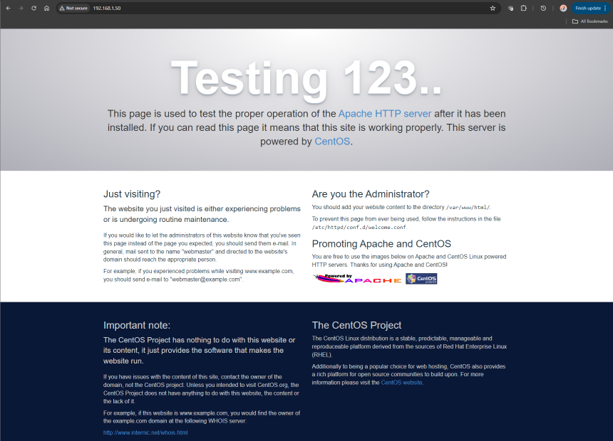

# Start-to-Finish Deployment Process
The below instructions lays out the process of establishing an Apache web server on a CentOS7 Linux server, on which a .NET Core 7 web application will be hosted perpetually as a service.

Whether or not the .NET application is developed yet, establishing the Apache web server is a good place to start.

# Establishing Apache Web Server on RHEL CentOS7
Step-by-step instructions to installing and running an Apache web server on home Linux server. The steps below follow this <a href="https://www.digitalocean.com/community/tutorials/how-to-install-the-apache-web-server-on-centos-7">DigitalOcean tutorial</a>.

***
### Prerequisites
The following requirements must be met before moving forward:
- **Non-root** user with sudo privileges configured on the server
- Domain name configured to point to the server
- Basic firewall configured on the server

The above requirements have additional resources for guidance at the link above, steps taken to establish Apache locally are recorded below. Once we get to the point of users and ownership, we will assume that our sudo-priveledged user already exists...in our case it is called **DM_USER**.

### Configuring Basic Firewall
CentOS7 comes with a native firewall called `firewalld`, within it `firewall-cmd` is used to configure firewall policies. This regulates permitting/denying traffic to every port on the server. (<a href="https://www.digitalocean.com/community/tutorials/additional-recommended-steps-for-new-centos-7-servers#configuring-a-basic-firewall">Documentation</a>)

As always, it is best practice to update libraries before installing a package:
```
sudo yum update
```

Install `firewalld`:
```
sudo yum install firewalld
```

The `firewalld` service can make modifications to permissions without affecting current connections, proceed to turn on the service.
```
sudo systemctl start firewalld
```

Now that the service is up and running, we need to set policy information for the firewall. The `firewalld` application uses 'zones' to label the trustworthiness of other hosts on the network. We need to first establish exceptions for approved services; for example, SSH is all important to maintain our access to the server.

If the SSH daemon is running on the default port, proceed as follows:
```
sudo firewall-cmd --permanent --add-service=ssh

sudo firewall-cmd --permanent --add-service=http

sudo firewall-cmd --permanent --add-service=https

sudo firewall-cmd --permanent --add-service=smtp
```
The additional services above open permissions for a HTTP web server, HTTPS web server with SSL/TLS enabled and SMTP email. You can see additional services to be enabled with:
```
sudo firewall-cmd --get-services
```
When you are finished, you can see the full list of exceptions to be implemented by listing all. If this all looks good, proceed to reload the service:
```
sudo firewall-cmd --permanent --list-all

sudo firewall-cmd --reload
```
If all goes well and testing is acceptable, enable to service to start at boot:
```
sudo systemctl enable firewalld
```
#### Configure Timezones
To configure timezones for your server, run the following:
```
sudo timedatectl list-timezones

sudo timedatectl set-timezone America/Denver
```
The first line lists all possible time zones, while the second assigns it. Running `sudo timedatectl` will confirm the current settings.

#### Configure NTP Synchronization
To ensure that our server stays synchronized with others, we can configure NTP synchronization. The following commands install, start and enable the service:
```
sudo yum install ntp

sudo systemctl start ntpd

sudo systemctl enable ntpd
```

### Creating a Swap File
Adding a 'swap' to the server allows it to move seldomly accessed information from a running program from RAM to some location on disk. While it is much slower to access information on disk, but this can be instrumental in preventing applications from failing...especially those hosting databases on the system.

**THESE STEPS WERE OMITTED ON LOCAL SETUP, RESEARCH IF THIS IS NEEDED ON TEST SERVER OR NOT**
```
sudo fallocate -l 4G /swapfile

sudo chmod 600 /swapfile

sudo mkswap /swapfile

sudo swapon /swapfile

sudo sh -c 'echo "/swapfile none swap sw 0 0" >> /etc/fstab'
```
***
## Step 1: Installing Apache
The Apache repository is available on CentOS defualt repositories and can be installed with:
```
sudo yum update httpd

sudo yum install httpd
```
If you have already established `firewalld` we need to open **port 80** to allow Apache to serve requests over HTTP, the same must be done for **port 443** if you plan to serve content over HTTPS. Add both services and reload the firewall service:
```
sudo firewall-cmd --permanent --add-service=http

sudo firewall-cmd --permanent --add-service=https

sudo firewall-cmd --reload
```
*Note: the above permissions should have already been added in establishing the firewall in previous steps...*

***
## Step 2: Checking the Web Server
Like other services, Apache will not start automatically upon installation. We will start the service manually for the first time with:
```
sudo systemctl start httpd

sudo systemctl status httpd
```
Successful start up will result in the following message:
```
● httpd.service - The Apache HTTP Server
   Loaded: loaded (/usr/lib/systemd/system/httpd.service; disabled; vendor preset: disabled)
   Active: active (running) since Tue 2024-06-04 14:40:21 MDT; 9s ago
     Docs: man:httpd(8)
           man:apachectl(8)
 Main PID: 23043 (httpd)
   Status: "Total requests: 0; Current requests/sec: 0; Current traffic:   0 B/sec"
   CGroup: /system.slice/httpd.service
           ├─23043 /usr/sbin/httpd -DFOREGROUND
           ├─23044 /usr/sbin/httpd -DFOREGROUND
           ├─23045 /usr/sbin/httpd -DFOREGROUND
           ├─23046 /usr/sbin/httpd -DFOREGROUND
           ├─23047 /usr/sbin/httpd -DFOREGROUND
           └─23048 /usr/sbin/httpd -DFOREGROUND
...
```
At this point, Apache is up and running and can be tested by visiting your server's IP address. By calling `hostname -I` you can see what network addresses are available, once you navigate to this address on your browser the following page should be served.



***
## Step 3: Managing the Apache Process
Now that the web server is up and running, the commands below outline some basic functionality:
```
// stop the web server...
sudo systemctl stop httpd

// start the web server...
sudo systemctl start httpd

// stop then start the web server (restart)...
sudo systemctl restart httpd

// restart without dropping connections...
sudo systemctl reload httpd

// prevent starting at runtime...
sudo systemctl disable httpd

// enable starting at runtime (default)...
sudo systemctl enable httpd
```

***
## Step 4: Setting Up Virtual Hosts (Best to Come Back After Application is Copied to Server)
The default Apache configuration enables the server to host a single website, if more than one domain will be hosted on the server it will be necessary to configure virtual hosts.

The following steps will establish a domain, `deliverymanager.tcsservices.com:40730`, on the server. By default, Apache on CentOS7 enables one server block to serve documents from at `/var/www/html`. Hosting multiple sites in this directory can be unwieldy, so instead we will create a directory structure within `/var/www` for each domain. This leaves the `/var/www/html` directory in place as the default directory if a request doesn't match any other sites.

Create the `html` and `log` directories, using the `-p` flag ensures creation of any necessary parent directories:
```
sudo mkdir -p /var/www/deliverymanager/html

sudo mkdir -p /var/www/deliverymanager/log
```

Next, ensure proper ownership of the `html` directory with the `$USER` (uses current user, else explicitly define user) environmental variable and set the permissions to default:
```
sudo chown -R $USER:$USER /var/www/deliverymanager/html

sudo chmod -R 755 /var/www
```

Using **vim** we will create a sample `index.html` file to test our VM with:
```
sudo vim /var/www/deliverymanager/html/index.html
```

With the site directory and index files in place, we need to create a `sites-available` directory to store our virtual hosts. We will also create a `sites-enabled` directory that tells Apache that a particular virtual host is ready to be served.

The latter directory will hold symbolic links to virtual hosts we want to publish, create both directories with:
```
sudo mkdir /etc/httpd/sites-available /etc/httpd/sites-enabled
```

Once created, we will edit the Apache config file, `httpd.conf`, to inform Apache to look for virtual hosts in the `sites-enabled` directory. Open the config file with:
```
sudo vim /etc/httpd/conf/httpd.conf
```
Add `IncludeOptional sites-enabled/*.conf` to the end of the file, save and close the file. 

Next, create a new config file in `sites-available` with `sudo vim /etc/httpd/sites-available/deliverymanager.conf` and place the following config block inside:
```
<VirtualHost *:*>
    RequestHeader set "X-Forwarded-Proto" expr=%{REQUEST_SCHEME}s
</VirtualHost>

<VirtualHost *:80>
    ProxyPreserveHost On
    ProxyPass / http://127.0.0.1:5000/
    ProxyPassReverse / http://127.0.0.1:5000/
    ServerName www.tcsservices.com:40730
    ServerAlias *.tcsservices.com:40730
    DocumentRoot /var/www/deliverymanager
    ErrorLog /var/www/deliverymanager/log/error.log
    CustomLog /var/www/deliverymanager/log/requests.log combined
</VirtualHost>
```

Once created we need to enable them so that Apache can serve them. We need to create a symbolic link for each virtual host in the `sites-enabled` directory with:
```
sudo ln -s /etc/httpd/sites-available/deliverymanager.conf /etc/httpd/sites-enabled/deliverymanager.conf
```
***
## Step 5: Adjusting SELinux Permissions for Virtual Hosts (Recommended)
Before restarting Apache, we want to be sure that SELinux has the correct policies in place for our new virtual host. SELinux is configured to work with the default Apache configuration, but since we set up a custom log directory in the virtual host config this will return an error on start up.

Apache needs be allowed to write to the necessary files, but disabling SELinux altogether is not a good idea as it brings with it a good amount of security. You can adjust SELinux universally as well as on a single directory, the latter is much more secure and thus is the recommended approach.

#### Adjusting Apache Policies Universally
Setting the Apache policy universally tells the SELinux to treat all Apache processes identically. While more convenient, we sacrifice the level of control that otherwise would be focused on particular files and/or directories.

Run the following command to set a universal Apache policy:
```
sudo setsebool -P httpd_unified 1
```
The `setsebool` command changes SELinux boolean values, the `-P` flag updates the boot-time value making this change persist across reboots, and the `httpd_unified` is the boolean telling SELinux to treat all Apache processes as the same (with a value of `1`).

#### Adjusting Apache Policies on a Directory
While this approach provides more control over our Apache processes, it also requires more maintenance. Since it is not universal, we need to be sure to manually set the context type for any new log directories specified in our viertual host configurations.

Begin by checking the context type that SELinux gave the new directory:
```
sudo ls -dZ /var/www/deliverymanager/log/
```
This will list and print the SELinux context of the directory, specifically the current context is defined as `httpd_sys_content_t` (read only). We will want to change it to `httpd_log_t` to allow Apache to generate and append web app log files and apply the changes to persist across reboots:
```
sudo semanage fcontext -a -t httpd_log_t "/var/www/deliverymanager/log(/.*)?"

sudo restorecon -R -v /var/www/deliverymanager/log
```
The `-R` flag runs the command recursively, updating all existing files to use the new context. The `-v` flag will print the context changes the command made. You can check the context with the aforementioned command to ensure the changes stuck.

***
# Deploying .NET Core 7 Application to Host Server
Step-by-step documentation of first attempt at deployment of .NET CORE driver manifest application to CENTOS7. 
***
## Prerequisites
Preparation of the CENTOS7 Linux server prior to hosting/deployment of .NET CORE application.

### Update **yum** Packages
This should be performed prior to attempting to download any package.<br>

```sudo yum update```

### Install .NET SDK
The .NET SDK allows you to develop apps with .NET. If the SDK is installed, the corresponding runtimes should automatically be downloaded.

```sudo yum install dotnet-sdk-7.0```

### Verify Installation Package
Verify the respective packages have been installed correctly.

```
sudo dotnet --info
ll /usr/share/dotnet/sdk
```

### Install Mod_SSL/Mod_Rewrite
The .NET SDK allows you to develop apps with .NET. If the SDK is installed, the corresponding runtimes should automatically be downloaded.

```sudo yum install mod_ssl```

```sudo yum install mod_rewrite```

### Publish Application
From Visual Studio, *Build -> Publish DriverChecklist*. Choose location to publish to ```C:\publish\driverChecklist\240427``` and ensure that the target runtime is set to *linux-x64*. 

Sounds like running the following command is also viable:

```dotnet publish --configuration Release```

### Publish Project to .NET7.0 with CLI
The steps above using the VS GUI produces a deployment package in the latest version of .NET (8.0), rather we can specify that we deploy to .NET7.0 using the CLI on the Linux server by running the following commands from the project directory (DeliveryChecklist/api/DeliveryChecklist):

```dotnet publish DeliveryChecklist -f net7.0 -c Release```

Which should publish to: 
```
  DriverChecklist -> C:\Users\camer\Desktop\Apps\DeliveryChecklist\api\DeliveryChecklist\DriverChecklist\bin\Release\net7.0\DriverChecklist.dll
  DriverChecklist -> C:\Users\camer\Desktop\Apps\DeliveryChecklist\api\DeliveryChecklist\DriverChecklist\bin\Release\net7.0\publish\
```

After uploading the resulting files to the server, restart and enable httpd on the apache server. Enable and start the *kestrel-deliverymanifest.service* before checking its status.

**Alternatively:** Use the GUI approach from Visual Studio for easy-to-navigate options to ensure the requirements are met above.

The current working version used the latter approach, replacing existing files with the latest deployment files and storing them in `C:/Users/camer/Desktop/Apps/DeliveryManager/DeliveryManager.Server/bin/Release/net7.0/publish/`. The files are relocated to the server to replace the existing ones.

### Copy Application to Server
FTP the published files to the server, it is suggested to store them at *var/www/deliverymanager*.

### Configure Proxy Server (refer to Apache setup above...)
Refer to https://learn.microsoft.com/en-us/aspnet/core/host-and-deploy/linux-apache?view=aspnetcore-8.0, none of the steps were followed as the config file could not be found.

### Configure Apache (refer to Apache setup above...)
Config files for Apache are stored in */etc/httpd/conf.d/* directory. In Apache on Ubuntu, all the virtual host config files are stored in */etc/apache2/sites-available*. Any file with the *.conf* extension is processed in alphabetical order in addition to the module configuration files in */etc/httpd/conf.modules.d*, which contains any configuration files necessary to load modules.

Create a configuration file, named *project_name.conf*, for the app:
```
<VirtualHost *:*>
    RequestHeader set "X-Forwarded-Proto" expr=%{REQUEST_SCHEME}s
</VirtualHost>

<VirtualHost *:80>
    ProxyPreserveHost On
    ProxyPass / http://127.0.0.1:5000/
    ProxyPassReverse / http://127.0.0.1:5000/
    ServerName www.tcsservices.com:40730
    ServerAlias *.tcsservices.com:40730
    DocumentRoot /var/www/deliverymanager
    ErrorLog /var/www/deliverymanager/log/error.log
    CustomLog /var/www/deliverymanager/log/requests.log combined
</VirtualHost>
```
Verify proper syntax by running ```apachectl configtest``` and restart Apache:
```
sudo systemctl restart httpd
sudo systemctl enable httpd
```

## Monitor the Application
Apache is now set up to forward requests made to *http://localhost:80* to the ASP.NET Core app running on Kestrel at *http://127.0.0.1:5000*. Though, Apache isn't set up to manage the Kestrel process.

Use *systemd* and create a service file to start and monitor the underlying web app. *systemd* is an init system that provides many powerful features for starting, stopping, and managing processes.

### Create the Service File
Create service definition file:

```sudo nano /etc/systemd/system/kestrel-deliverymanager.service```

```
[Unit]
Description=Example .NET Web API App running on CentOS 7

[Service]
WorkingDirectory=/var/www/deliverymanager
ExecStart=/usr/share/dotnet/dotnet /var/www/deliverymanager/DeliveryManager.Server.dll
Restart=always
# Restart service after 10 seconds if the dotnet service crashes:
RestartSec=10
KillSignal=SIGINT

StandardOutput=syslog
StandardError=syslog
SyslogIdentifier=dotnet-DM

#User=apache
User=DM_User
Environment=ASPNETCORE_ENVIRONMENT=Production 
Environment=DOTNET_CLI_HOME=/tmp

[Install]
WantedBy=multi-user.target
```

Use *TimeoutStopSet* to configure the duration of time to wait for the app to shut down after it receives the intial interrupt signal. If the app doesn't shut down in this period, SIGKILL is issued to terminate the app. If nothing is specified, it defaults to the value *DefaultTimeoutStopSec* in the manager configuration file (systemd-system.conf, system.conf.d, systemd-user.conf, user.conf.d). Most defaults are set for 90 seconds.

**Note:** The preceding example used *DM_User* as the specified User, this user must exist and have proper ownership over the app's files.

#### Create ```DM_User``` User on Linux
Create *DM_User* user and ensure ownership/priveledges to the project directory to the user.
```
adduser DM_User
passwd DM_User
usermod -aG DM_User DM_User
chown -R DM_User:DM_User /var/www/html
systemctl restart httpd
```

### Establish SQL Connection String (unsure on this...)
Some values, including SQL connection strings must be escaped for the configuration providers to read the environment variables. Use the following command to generate a properly escaped value for use in the configuration file:<br>
```
systemd-escape "ConnectionStrings_DefaultConnection"
#Environment=ConnectionStrings__DefaultConnection={"/opt/mssql-tools/bin/sqlcmd -U SA -P Sql2023! -S 192.168.1.33,1433 -d TCSWEB"}
export ConnectionStrings__DefaultConnection="/opt/mssql-tools/bin/sqlcmd -U SA -P Sql2023! -S 192.168.1.33,1433 -d TCSWEB"
```
This *may* need to be reworked to ensure this environment variable persists...

### Enable and Start Service
Save the file/variables and enable the service.

```systemctl enable kestrel-deliverymanifest.service```

Start the service and verify that it is running:
```
sudo systemctl start kestrel-deliverymanifest.service
sudo systemctl status kestrel-deliverymanifest.service
```

## Enable React in .NET Deployment
This may or may not be necessary if you begin with creating a "React and ASP.NET Core" project template. Ensure that these are necessary before proceeding...

First we need to assemble the React build files by running,
```npm run build``

Refer to this StackOverflow post for tips for integrating static files, https://stackoverflow.com/questions/75180838/deploy-asp-net-core-7-web-api-with-react-front-end.

Refer to the latest repository for the working Program.cs file.

# Configure Application for Hosting on Sub-Domain
The above directions work to establish and host an application on a Linux server at an established URL. Though, we are hoping to host this on its own dedicated sub-domain.