# Delivery Validation Microservice

---

## Project Overview

This repository contains a dedicated microservice focused on **delivery validation, manifest interaction, and real-time delivery updates** for a trucking logistics company. It forms a crucial part of a larger, microservices-based web application designed to streamline delivery tracking and driver log management.

### Repository Structure

This repository is organized into distinct projects:

* **`DeliveryManager.Client`**: The **React-based frontend** (JavaScript, CSS, HTML) responsible for the intuitive user interface.
* **`DeliveryManager.Server`**: The **.NET backend** (C#) that constitutes this specific microservice, handling secure and efficient database transactions related to delivery records.
* **`DeliveryManager.Server.Tests`**: Contains comprehensive **backend unit and integration tests** for the `DeliveryManager.Server` microservice.

---

## Architecture and Integration

This microservice operates within a broader ecosystem of services, notably interacting with a separate **Login Portal Microservice**.

* **Authentication & Authorization (SSO):** This service does *not* handle user login directly. Instead, it receives a validated session through the Login Portal Microservice. Requests to this service's protected endpoints expect a valid **JWT (JSON Web Token)** to be present, which is issued and managed by the Login Portal. **Single Sign-On (SSO)** is utilized to prevent compromising data with duplicate sessions on the same delivery manifest.
* **Token Validation:** This microservice includes its own `TokenService` to validate incoming JWTs against a shared secret key and configuration. This allows it to independently verify the authenticity and authorization of requests, including refreshing access tokens if the refresh token is valid and needs to be renewed.
* **Data Interaction:** It directly interfaces with each client's delivery manifest database, ensuring all delivery-related operations are performed securely and efficiently.

---

# deliverymanager.client
React (JavaScript) based frontend server integrated and run by the .NET local development environment (in local development) and a kestrel service on the Apache deployment server.
## UX/UI Workflow (Driver Process Flow)

The following figures illustrate the driver's interaction with the components managed by this microservice.


*Figure 1.0: Driver Interface*

### 1. Delivery Validation and Manifest Identification

The initial step involves **delivery validation**, where a manifest date and power unit (vehicle ID) are used to identify a specific delivery manifest in the records. This microservice validates these inputs against the database.

* **Error Handling:** Errors during this validation process are handled with dynamic styling and clear prompts on the frontend, ensuring immediate user feedback.
* **SSO Enforcement:** The system ensures that only one active session can access a particular delivery manifest at a time, preventing data corruption from duplicate sessions.

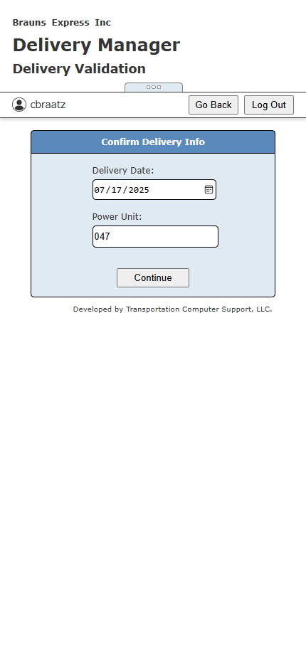

*Figure 1.1: Delivery Validation*

### 2. Interactive Delivery Manifest

Once validated, the **delivery manifest is rendered as an interactive table** displaying a comprehensive list of the driver’s assigned deliveries, categorized into **undelivered** and **delivered** shipments. Undelivered deliveries are prioritized and displayed at the top for quick access, while delivered entries appear below.

#### Interactive Table Functionality

The manifest is designed to be highly interactive, enhancing usability across various devices:

* **Responsive Display:** The table dynamically adjusts its data to the width of the display, truncating non-essential fields on smaller screens (e.g., mobile devices held vertically) and rendering additional columns on wider displays (e.g., horizontal orientation, tablets/PCs).
* **Touch and Click Interaction:** Drivers can tap (on mobile) or click (on tablets/PCs) any row in the table to access detailed delivery information for editing.

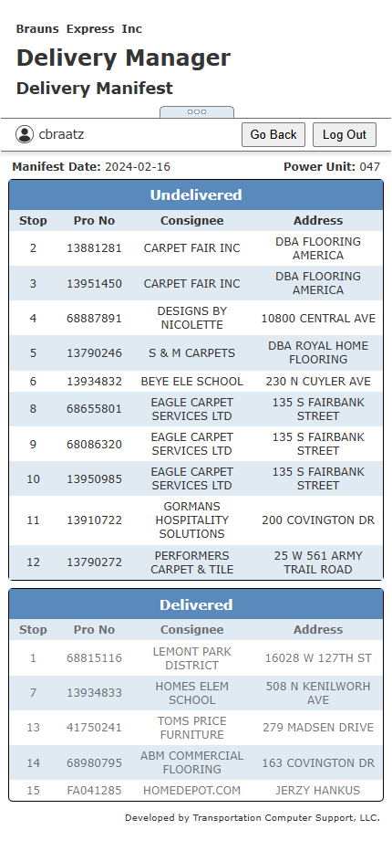

*Figure 2.0: Delivery Manifest - Mobile*

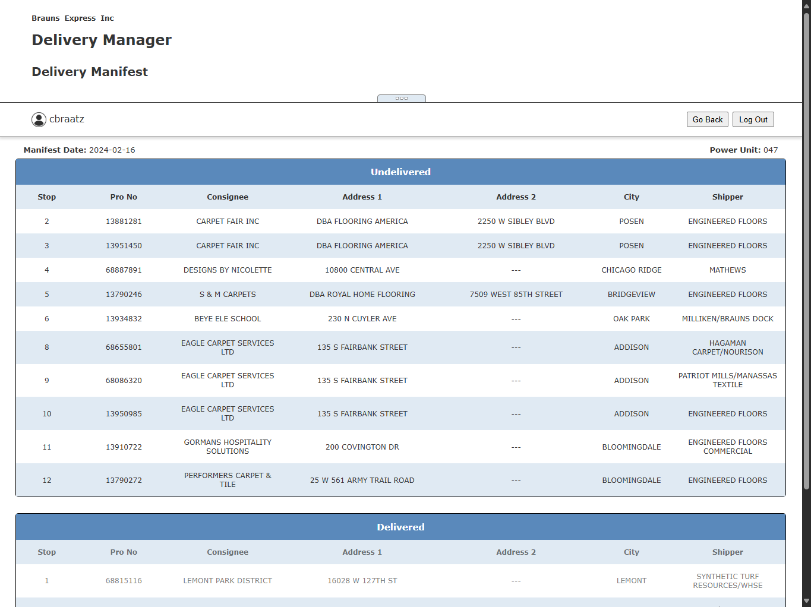

*Figure 2.1: Delivery Manifest - Tablet*

### 3. Expanded Delivery Information & Updates

Users select deliveries from the manifest and are led to the **delivery form window** where they can make updates to the delivery records. This microservice processes all updates submitted from this view.

The **Expanded Delivery Information** page empowers drivers to input delivery details through text and number fields, while leveraging custom-built widgets for advanced functionalities like signature collection and image capture.

#### Update Capabilities:

* **Basic Details:** Update delivery date, time, and pieces delivered.
* **Exception Notes:** Add or modify notes for specific delivery exceptions.
* **Signature Collection:** Drivers can use the signature widget to digitally sign for deliveries, drawing by cursor or finger.
* **Package Location Image Collection:** Image files are uploaded through native device drivers (e.g., camera roll, file picker). Captured images are dynamically rendered as thumbnails immediately upon upload. Thumbnails also double as interactive buttons, allowing drivers to replace existing images with new uploads.

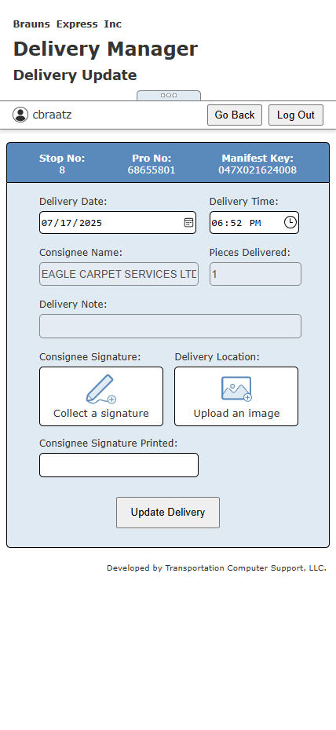

*Figure 3.0: Expanded Delivery Information*

#### Batch Updates and Filtering:

* If multiple deliveries share an address, the deliveries are intuitively filtered through checkbox selection, and **batch updates are supported** (with limited exception options).

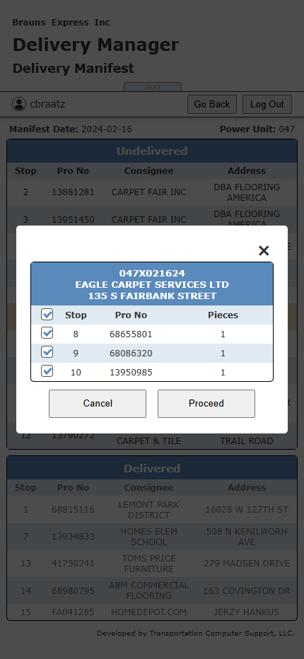

*Figure 3.1: Expanded Delivery Information*

#### Editing Flexibility:

* Users can choose to edit both **undelivered and delivered deliveries** alike.
* The system also supports **resetting deliveries** to their original status in cases of user error or unforeseen changes, providing robust error correction capabilities.

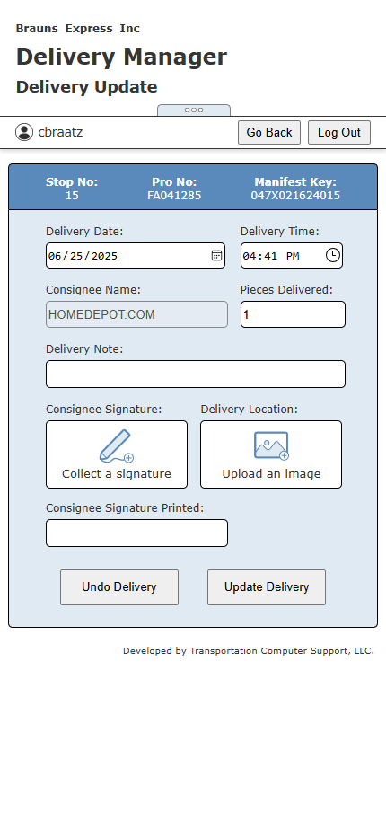

*Figure 3.2: Expanded Delivery Information*

#### Signature/Image Storage and Retrieval Workflow

This microservice implements the following workflow for images:

* The location and signature images are saved locally on the deployment server where this service is hosted.
* Their file names (paths) are stored in the database for efficient record management.
* Backend logic within this service handles image retrieval by accepting requests with valid file names/paths and returning the corresponding image data for rendering on client-side subsequent accesses.

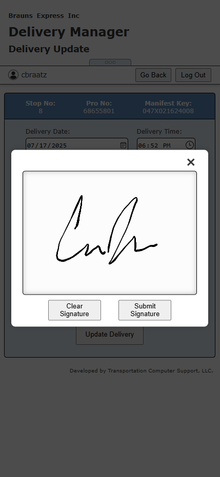

*Figure 3.3: Signature Capture*

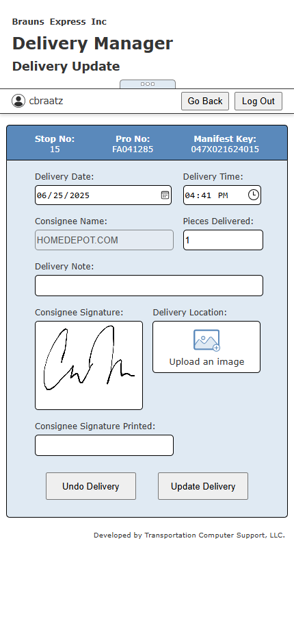

*Figure 3.4: Signature Thumbnail render*

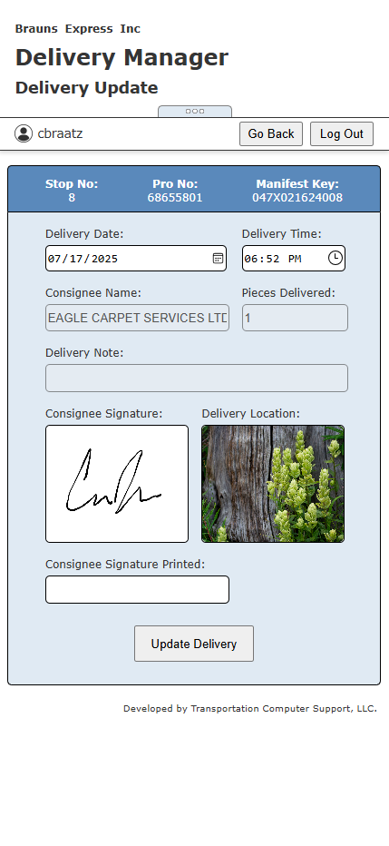

*Figure 3.5: Signature and Location Thumbnails render*

---

## Visual Feedback for Database Changes

This microservice provides the data and status updates that drive the client-side visual feedback, using custom graphic icons and specific feedback messages to visually confirm the outcome of database interactions. This enhances the user experience by communicating the status of each operation, clearly and effectively.

### Success Icons

Processed responses from this service trigger success icons for successful database updates, ensuring users receive immediate confirmation.

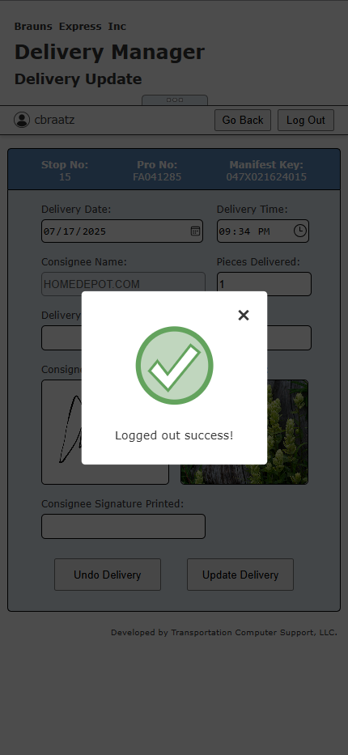

*Figure 3.6: Success Iconography*

### Error Icons

Failed requests handled by this service result in error icons with accompanying messages to guide corrective actions.

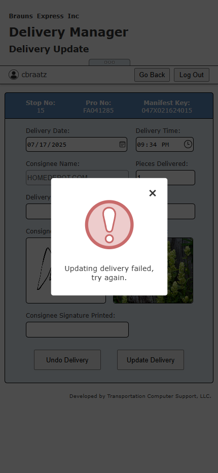

*Figure 3.7: Fail Iconography*

### Validation Icons

Input validation performed by this service (or related client-side logic) contributes to displaying icons indicating invalid or missing inputs for required fields, prompting users to address errors before proceeding.

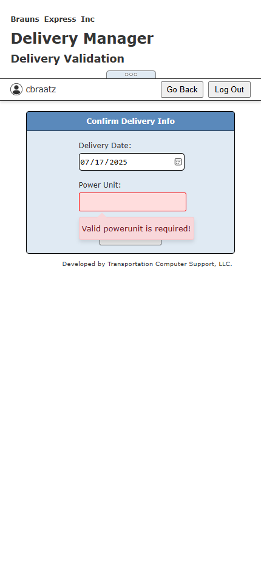

*Figure 3.8: Form/Field Validation*

# DeliveryManager.Server
description in progress...

# DeliveryManager.Server.Tests
Comprehensive regression testing has been integrated to protect the current working state of our backend, streamline continued development and confidently deploy new versions as they are developed.

The testing framework leverages the `unittest` Python testing library to automate the testing process, further supporting future debugging by offering custom formatted (color rendered in console) logging to track progress, status messages and isolate issues quickly and effectively.

Custom endpoints mock up a developer session, complete with server assigned Auth tokens to directly implement the current backend logic on a locally cloned set of database tables. Running the final set of tests in a clone environment to ensure recent updates have not broken existing infrastructure.

## Verbose Test Output
```
py run_tests.py --verbose

*** Starting all tests using unittest discovery ***

---------------------------------------------------------------
--- Setting up test data in database for DeliveriesApiTests ---
---------------------------------------------------------------
--- DB_UTIL: Inserting user: testUser_a21fbdc5 (Powerunit: a21)

        credentials: testUser_a21fbdc5, password, None, a21, ['BRAUNS', 'NTS'], ['admin', 'deliverymanager']
--- DB_UTIL: User 'testUser_a21fbdc5' inserted successfully.
--- DB_UTIL: Inserting manifest: PYTESTUNDLV01 (Powerunit: a21, Date: 20250718)
--- DB_UTIL: Manifest 'PYTESTUNDLV01' inserted successfully.
--- DB_UTIL: Inserting manifest: PYTESTUNDLV02 (Powerunit: a21, Date: 20250718)
--- DB_UTIL: Manifest 'PYTESTUNDLV02' inserted successfully.
--- DB_UTIL: Inserting manifest: PYTESTDLV01 (Powerunit: a21, Date: 20250718)
--- DB_UTIL: Manifest 'PYTESTDLV01' inserted successfully.
--- DB_UTIL: Inserting manifest: PYTESTDLV02 (Powerunit: a21, Date: 20250718)
--- DB_UTIL: Manifest 'PYTESTDLV02' inserted successfully.
--- DB_UTIL: Inserting manifest: UPDX071025001 (Powerunit: a21, Date: 20250718)
--- DB_UTIL: Manifest 'UPDX071025001' inserted successfully.
--- DB_UTIL: Inserting manifest: UPDX071025002 (Powerunit: a21, Date: 20250718)
--- DB_UTIL: Manifest 'UPDX071025002' inserted successfully.
--- DB_UTIL: Created test image file: 09785a055bfe489680e5647.png
Test data setup complete

------------------------------------
--- Beginning DeliveriesApiTests ---
------------------------------------
test_10_update_delivery_unauthorized (deliveries_tests.DeliveriesApiTests.test_10_update_delivery_unauthorized) ...
--- Running Test: test_10_update_delivery_unauthorized ---

--- Attempting dev-login to: https://localhost:7200/v1/sessions/dev-login?username=testUser_a21fbdc5&company=TCS ---
  > GET https://localhost:7200/v1/sessions/dev-login?username=testUser_a21fbdc5&company=TCS - Dev Login Valid session
  < Status: 200
Successfully authenticated session via dev-login.

--- Attempting Update Delivery (Unauthorized) ---
  > PUT https://localhost:7200/v1/deliveries/UPDX071025001 - Update Delivery for MFSTKEY UPDX071025001 with data {'MFSTKEY': 'UPDX071025001', 'STATUS': '1', 'LASTUPDATE': '20250718115130', 'MFSTNUMBER': 'UPDX071025', 'POWERUNIT': 'a21', 'STOP': '1', 'MFSTDATE': '071', 'PRONUMBER': '7071a755', 'PRODATE': '071', 'SHIPNAME': 'STANTON CARPET', 'CONSNAME': 'ACE FLOORING DISTRIBUTORS INC', 'CONSADD1': 'HOMEDEPOT.COM', 'CONSADD2': '9 CRANFORD DR', 'CONSCITY': 'NEW CITY', 'CONSSTATE': 'CO', 'CONSZIP': '80209', 'TTLPCS': 3, 'TTLYDS': 333, 'TTLWGT': 999, 'DLVDDATE': '20250718', 'DLVDTIME': '1200', 'DLVDPCS': 3, 'DLVDSIGN': '', 'DLVDNOTE': 'internal update test', 'DLVDIMGFILELOCN': '', 'DLVDIMGFILESIGN': '', 'signature_string': '', 'location_string': ''}
  < Status: 401
Test Update Delivery (Unauthorized) PASSED.

--- CLEANUP: Logging out session for testUser_a21fbdc5 ---
  > POST https://localhost:7200/v1/sessions/logout - Logging out current session
  < Status: 200
  < Response: {
  "message": "Logged out successfully"
}
  < CLEANUP: Session logged out successfully.
ok
test_11_update_delivery_mfstkey_mismatch (deliveries_tests.DeliveriesApiTests.test_11_update_delivery_mfstkey_mismatch) ...
--- Running Test: test_11_update_delivery_mfstkey_mismatch ---

--- Attempting dev-login to: https://localhost:7200/v1/sessions/dev-login?username=testUser_a21fbdc5&company=TCS ---
  > GET https://localhost:7200/v1/sessions/dev-login?username=testUser_a21fbdc5&company=TCS - Dev Login Valid session
  < Status: 200
Successfully authenticated session via dev-login.

--- Attempting Update Delivery (MFSTKEY Mismatch) ---
  > PUT https://localhost:7200/v1/deliveries/CONX07102500 <--[conflict] - Update Delivery for MFSTKEY UPDX07102500 with data {'MFSTKEY': 'UPDX071025001', 'STATUS': '1', 'LASTUPDATE': '20250718115131', 'MFSTNUMBER': 'UPDX071025', 'POWERUNIT': 'a21', 'STOP': '1', 'MFSTDATE': '071', 'PRONUMBER': '077562dc', 'PRODATE': '071', 'SHIPNAME': 'STANTON CARPET', 'CONSNAME': 'ACE FLOORING DISTRIBUTORS INC', 'CONSADD1': 'HOMEDEPOT.COM', 'CONSADD2': '9 CRANFORD DR', 'CONSCITY': 'NEW CITY', 'CONSSTATE': 'CO', 'CONSZIP': '80209', 'TTLPCS': 3, 'TTLYDS': 333, 'TTLWGT': 999, 'DLVDDATE': '20250718', 'DLVDTIME': '1200', 'DLVDPCS': 3, 'DLVDSIGN': '', 'DLVDNOTE': 'internal update test', 'DLVDIMGFILELOCN': '', 'DLVDIMGFILESIGN': '', 'signature_string': '', 'location_string': ''}
  < Status: 400
  < Response: {
  "message": "MFSTKEY in URL must match MFSTKEY in request body."
}
Test Update Delivery (MFSTKEY Mismatch) PASSED.

--- CLEANUP: Logging out session for testUser_a21fbdc5 ---
  > POST https://localhost:7200/v1/sessions/logout - Logging out current session
  < Status: 200
  < Response: {
  "message": "Logged out successfully"
}
  < CLEANUP: Session logged out successfully.
ok
test_12_update_delivery_not_found (deliveries_tests.DeliveriesApiTests.test_12_update_delivery_not_found) ... 
--- Running Test: test_12_update_delivery_not_found ---

--- Attempting dev-login to: https://localhost:7200/v1/sessions/dev-login?username=testUser_a21fbdc5&company=TCS ---
  > GET https://localhost:7200/v1/sessions/dev-login?username=testUser_a21fbdc5&company=TCS - Dev Login Valid session
  < Status: 200
Successfully authenticated session via dev-login.

--- Attempting Update Delivery (Not Found) ---
  > PUT https://localhost:7200/v1/deliveries/NANX071025001 - Update Delivery for MFSTKEY NANX071025001 with data {'MFSTKEY': 'NANX071025001', 'STATUS': '1', 'LASTUPDATE': '20250718115131', 'MFSTNUMBER': 'NANX071025', 'POWERUNIT': 'a21', 'STOP': '1', 'MFSTDATE': '071', 'PRONUMBER': '93083a61', 'PRODATE': '071', 'SHIPNAME': 'STANTON CARPET', 'CONSNAME': 'ACE FLOORING DISTRIBUTORS INC', 'CONSADD1': 'HOMEDEPOT.COM', 'CONSADD2': '9 CRANFORD DR', 'CONSCITY': 'NEW CITY', 'CONSSTATE': 'CO', 'CONSZIP': '80209', 'TTLPCS': 3, 'TTLYDS': 333, 'TTLWGT': 999, 'DLVDDATE': '20250718', 'DLVDTIME': '1200', 'DLVDPCS': 3, 'DLVDSIGN': '', 'DLVDNOTE': 'internal update test', 'DLVDIMGFILELOCN': '', 'DLVDIMGFILESIGN': '', 'signature_string': '', 'location_string': ''}
  < Status: 500
  < Response: {
  "message": "Failed to update delivery. Check server logs."
}
Test Update Delivery (Not Found/Service Failed) PASSED.

--- CLEANUP: Logging out session for testUser_a21fbdc5 ---
  > POST https://localhost:7200/v1/sessions/logout - Logging out current session
  < Status: 200
  < Response: {
  "message": "Logged out successfully"
}
  < CLEANUP: Session logged out successfully.
ok
test_13_get_image_success (deliveries_tests.DeliveriesApiTests.test_13_get_image_success) ...
--- Running Test: test_13_get_image_success ---

--- Attempting dev-login to: https://localhost:7200/v1/sessions/dev-login?username=testUser_a21fbdc5&company=TCS ---
  > GET https://localhost:7200/v1/sessions/dev-login?username=testUser_a21fbdc5&company=TCS - Dev Login Valid session
  < Status: 200
Successfully authenticated session via dev-login.

--- Attempting Get Image (Success) ---
  > GET https://localhost:7200/v1/deliveries/image/09785a055bfe489680e5647.png - Get Image for fileName 09785a055bfe489680e5647.png
  < Status: 200
Test Get Image (Success) PASSED.

--- CLEANUP: Logging out session for testUser_a21fbdc5 ---
  > POST https://localhost:7200/v1/sessions/logout - Logging out current session
  < Status: 200
  < Response: {
  "message": "Logged out successfully"
}
  < CLEANUP: Session logged out successfully.
ok
test_14_get_image_unauthorized (deliveries_tests.DeliveriesApiTests.test_14_get_image_unauthorized) ... 
--- Running Test: test_14_get_image_unauthorized ---

--- Attempting dev-login to: https://localhost:7200/v1/sessions/dev-login?username=testUser_a21fbdc5&company=TCS ---
  > GET https://localhost:7200/v1/sessions/dev-login?username=testUser_a21fbdc5&company=TCS - Dev Login Valid session
  < Status: 200
Successfully authenticated session via dev-login.

--- Attempting Get Image (Unauthorized) ---
  > GET https://localhost:7200/v1/deliveries/image/09785a055bfe489680e5647.png - Get Image for fileName 09785a055bfe489680e5647.png
  < Status: 401
Test Get Image (Unauthorized) PASSED.

--- CLEANUP: Logging out session for testUser_a21fbdc5 ---
  > POST https://localhost:7200/v1/sessions/logout - Logging out current session
  < Status: 200
  < Response: {
  "message": "Logged out successfully"
}
  < CLEANUP: Session logged out successfully.
ok
test_15_get_image_not_found (deliveries_tests.DeliveriesApiTests.test_15_get_image_not_found) ...
--- Running Test: test_15_get_image_not_found ---

--- Attempting dev-login to: https://localhost:7200/v1/sessions/dev-login?username=testUser_a21fbdc5&company=TCS ---
  > GET https://localhost:7200/v1/sessions/dev-login?username=testUser_a21fbdc5&company=TCS - Dev Login Valid session
  < Status: 200
Successfully authenticated session via dev-login.

--- Attempting Get Image (Not Found) ---
  > GET https://localhost:7200/v1/deliveries/image/nonexistent_image.jpg - Get Image for fileName nonexistent_image.jpg
  < Status: 404
Test Get Image (Not Found) PASSED.

--- CLEANUP: Logging out session for testUser_a21fbdc5 ---
  > POST https://localhost:7200/v1/sessions/logout - Logging out current session
  < Status: 200
  < Response: {
  "message": "Logged out successfully"
}
  < CLEANUP: Session logged out successfully.
ok
test_1_validate_and_assign_success (deliveries_tests.DeliveriesApiTests.test_1_validate_and_assign_success) ...
--- Running Test: test_1_validate_and_assign_success ---

--- Attempting dev-login to: https://localhost:7200/v1/sessions/dev-login?username=testUser_a21fbdc5&company=TCS ---
  > GET https://localhost:7200/v1/sessions/dev-login?username=testUser_a21fbdc5&company=TCS - Dev Login Valid session
  < Status: 200
Successfully authenticated session via dev-login.

--- Test 1: Validate and Assign (Success) ---

--- Attempting Validate and Assign (200 Success) ---
  > POST https://localhost:7200/v1/deliveries/validate-and-assign - Validate and Assign Manifest with:
        {'USERNAME': 'testUser_a21fbdc5', 'POWERUNIT': 'a21', 'MFSTDATE': '20250718'}
  < Status: 200
  < Response: {
  "message": "Valid date/powerunit combination was found.",
  "manifest": {
    "MFSTKEY": "PYTESTDLV01",
    "STATUS": "1",
    "LASTUPDATE": "20250718115130",
    "MFSTNUMBER": "PYTESTDLV0",
    "POWERUNIT": "a21",
    "STOP": 1,
    "MFSTDATE": "20250718",
    "PRONUMBER": "",
    "PRODATE": "20250718",
    "SHIPNAME": "Test Shipper",
    "CONSNAME": "HOMEDEPOT.COM",
    "CONSADD1": "123 Test St",
    "CONSADD2": "",
    "CONSCITY": "Denver",
    "CONSSTATE": "CO",
    "CONSZIP": "80202",
    "TTLPCS": 1,
    "TTLYDS": 1,
    "TTLWGT": 1,
    "DLVDDATE": "20250718",
    "DLVDTIME": "1200",
    "DLVDPCS": 0,
    "DLVDSIGN": "Test Signature Automate",
    "DLVDNOTE": "db_util default note",
    "DLVDIMGFILELOCN": "",
    "DLVDIMGFILESIGN": ""
  }
}
Test Validate and Assign (Success) PASSED.

--- CLEANUP: Logging out session for testUser_a21fbdc5 ---
  > POST https://localhost:7200/v1/sessions/logout - Logging out current session
  < Status: 200
  < Response: {
  "message": "Logged out successfully"
}
  < CLEANUP: Session logged out successfully.
ok
test_2_validate_and_assign_unauthorized (deliveries_tests.DeliveriesApiTests.test_2_validate_and_assign_unauthorized) ... 
--- Running Test: test_2_validate_and_assign_unauthorized ---

--- Attempting dev-login to: https://localhost:7200/v1/sessions/dev-login?username=testUser_a21fbdc5&company=TCS ---
  > GET https://localhost:7200/v1/sessions/dev-login?username=testUser_a21fbdc5&company=TCS - Dev Login Valid session
  < Status: 200
Successfully authenticated session via dev-login.

--- Attempting Validate and Assign (401 Unauthorized) ---
  > POST https://localhost:7200/v1/deliveries/validate-and-assign - Validate and Assign Manifest with:
        {'USERNAME': 'testUser_a21fbdc5', 'POWERUNIT': 'PYTEST01', 'MFSTDATE': '20250718'}
  < Status: 401
Test Validate and Assign (Unauthorized) PASSED.

--- CLEANUP: Logging out session for testUser_a21fbdc5 ---
  > POST https://localhost:7200/v1/sessions/logout - Logging out current session
  < Status: 200
  < Response: {
  "message": "Logged out successfully"
}
  < CLEANUP: Session logged out successfully.
ok
test_3_validate_and_assign_bad_request_missing_fields (deliveries_tests.DeliveriesApiTests.test_3_validate_and_assign_bad_request_missing_fields) ... 
--- Running Test: test_3_validate_and_assign_bad_request_missing_fields ---

--- Attempting dev-login to: https://localhost:7200/v1/sessions/dev-login?username=testUser_a21fbdc5&company=TCS ---
  > GET https://localhost:7200/v1/sessions/dev-login?username=testUser_a21fbdc5&company=TCS - Dev Login Valid session
  < Status: 200
Successfully authenticated session via dev-login.

--- Attempting Validate and Assign (400 Bad Request - Missing Fields) ---
  > POST https://localhost:7200/v1/deliveries/validate-and-assign - Validate and Assign Manifest with:
        {'USERNAME': 'testUser_a21fbdc5'}
  < Status: 400
  < Response: {
  "errors": {
    "MFSTDATE": [
      "Manifest date is required."
    ],
    "POWERUNIT": [
      "Powerunit is required."
    ]
  },
  "type": "https://tools.ietf.org/html/rfc7231#section-6.5.1",
  "title": "One or more validation errors occurred.",
  "status": 400,
  "traceId": "00-64a4db889186523a4638ef12b555c74d-2484ed5df574c421-00"
}
Test Validate and Assign (Bad Request - Missing Fields) PASSED.

--- CLEANUP: Logging out session for testUser_a21fbdc5 ---
  > POST https://localhost:7200/v1/sessions/logout - Logging out current session
  < Status: 200
  < Response: {
  "message": "Logged out successfully"
}
  < CLEANUP: Session logged out successfully.
ok
test_4_validate_and_assign_no_manifest_found (deliveries_tests.DeliveriesApiTests.test_4_validate_and_assign_no_manifest_found) ...
--- Running Test: test_4_validate_and_assign_no_manifest_found ---

--- Attempting dev-login to: https://localhost:7200/v1/sessions/dev-login?username=testUser_a21fbdc5&company=TCS ---
  > GET https://localhost:7200/v1/sessions/dev-login?username=testUser_a21fbdc5&company=TCS - Dev Login Valid session
  < Status: 200
Successfully authenticated session via dev-login.

--- Attempting Validate and Assign (404 Not Found) ---
  > POST https://localhost:7200/v1/deliveries/validate-and-assign - Validate and Assign Manifest with:
        {'USERNAME': 'testUser_a21fbdc5', 'POWERUNIT': '-1', 'MFSTDATE': '20250718'}
  < Status: 404
  < Response: {
  "message": "Invalid date/powerunit combination. No matching delivery manifests found for the provided details."
}
Test Validate and Assign (No Manifest Found) PASSED.

--- CLEANUP: Logging out session for testUser_a21fbdc5 ---
  > POST https://localhost:7200/v1/sessions/logout - Logging out current session
  < Status: 200
  < Response: {
  "message": "Logged out successfully"
}
  < CLEANUP: Session logged out successfully.
ok
test_5_get_deliveries_success_with_data (deliveries_tests.DeliveriesApiTests.test_5_get_deliveries_success_with_data) ...
--- Running Test: test_5_get_deliveries_success_with_data ---

--- Attempting dev-login to: https://localhost:7200/v1/sessions/dev-login?username=testUser_a21fbdc5&company=TCS ---
  > GET https://localhost:7200/v1/sessions/dev-login?username=testUser_a21fbdc5&company=TCS - Dev Login Valid session
  < Status: 200
Successfully authenticated session via dev-login.

--- Attempting Get Deliveries (200 Success w/ Data) ---
  > GET https://localhost:7200/v1/deliveries - Get Deliveries with params {'powerunit': 'a21', 'mfstdate': '20250718'}
  < Status: 200
  < Response: {
  "Undelivered": [
    {
      "MFSTKEY": "PYTESTUNDLV01",
      "STATUS": "0",
      "LASTUPDATE": "20250718115130",
      "MFSTNUMBER": "PYTESTUNDL",
      "POWERUNIT": "a21",
      "STOP": 1,
      "MFSTDATE": "20250718",
      "PRONUMBER": "",
      "PRODATE": "20250718",
      "SHIPNAME": "Test Shipper",
      "CONSNAME": "HOMEDEPOT.COM",
      "CONSADD1": "123 Test St",
      "CONSADD2": "",
      "CONSCITY": "Denver",
      "CONSSTATE": "CO",
      "CONSZIP": "80202",
      "TTLPCS": 1,
      "TTLYDS": 1,
      "TTLWGT": 1,
      "DLVDDATE": "",
      "DLVDTIME": "",
      "DLVDPCS": 0,
      "DLVDSIGN": "",
      "DLVDNOTE": "db_util default note",
      "DLVDIMGFILELOCN": "",
      "DLVDIMGFILESIGN": ""
    },
    {
      "MFSTKEY": "UPDX071025001",
      "STATUS": "0",
      "LASTUPDATE": "20250718115130",
      "MFSTNUMBER": "UPDX071025",
      "POWERUNIT": "a21",
      "STOP": 1,
      "MFSTDATE": "20250718",
      "PRONUMBER": "",
      "PRODATE": "20250718",
      "SHIPNAME": "Test Shipper",
      "CONSNAME": "HOMEDEPOT.COM",
      "CONSADD1": "123 Test St",
      "CONSADD2": "",
      "CONSCITY": "Denver",
      "CONSSTATE": "CO",
      "CONSZIP": "80202",
      "TTLPCS": 1,
      "TTLYDS": 1,
      "TTLWGT": 1,
      "DLVDDATE": "",
      "DLVDTIME": "",
      "DLVDPCS": 0,
      "DLVDSIGN": "",
      "DLVDNOTE": "db_util default note",
      "DLVDIMGFILELOCN": "",
      "DLVDIMGFILESIGN": ""
    },
    {
      "MFSTKEY": "UPDX071025002",
      "STATUS": "0",
      "LASTUPDATE": "20250718115130",
      "MFSTNUMBER": "UPDX071025",
      "POWERUNIT": "a21",
      "STOP": 2,
      "MFSTDATE": "20250718",
      "PRONUMBER": "",
      "PRODATE": "20250718",
      "SHIPNAME": "Test Shipper",
      "CONSNAME": "HOMEDEPOT.COM",
      "CONSADD1": "123 Test St",
      "CONSADD2": "",
      "CONSCITY": "Denver",
      "CONSSTATE": "CO",
      "CONSZIP": "80202",
      "TTLPCS": 1,
      "TTLYDS": 1,
      "TTLWGT": 1,
      "DLVDDATE": "",
      "DLVDTIME": "",
      "DLVDPCS": 0,
      "DLVDSIGN": "",
      "DLVDNOTE": "db_util default note",
      "DLVDIMGFILELOCN": "",
      "DLVDIMGFILESIGN": ""
    },
    {
      "MFSTKEY": "PYTESTUNDLV02",
      "STATUS": "0",
      "LASTUPDATE": "20250718115130",
      "MFSTNUMBER": "PYTESTUNDL",
      "POWERUNIT": "a21",
      "STOP": 2,
      "MFSTDATE": "20250718",
      "PRONUMBER": "",
      "PRODATE": "20250718",
      "SHIPNAME": "Test Shipper",
      "CONSNAME": "HOMEDEPOT.COM",
      "CONSADD1": "123 Test St",
      "CONSADD2": "",
      "CONSCITY": "Denver",
      "CONSSTATE": "CO",
      "CONSZIP": "80202",
      "TTLPCS": 1,
      "TTLYDS": 1,
      "TTLWGT": 1,
      "DLVDDATE": "",
      "DLVDTIME": "",
      "DLVDPCS": 0,
      "DLVDSIGN": "",
      "DLVDNOTE": "db_util default note",
      "DLVDIMGFILELOCN": "",
      "DLVDIMGFILESIGN": ""
    }
  ],
  "Delivered": [
    {
      "MFSTKEY": "PYTESTDLV01",
      "STATUS": "1",
      "LASTUPDATE": "20250718115130",
      "MFSTNUMBER": "PYTESTDLV0",
      "POWERUNIT": "a21",
      "STOP": 1,
      "MFSTDATE": "20250718",
      "PRONUMBER": "",
      "PRODATE": "20250718",
      "SHIPNAME": "Test Shipper",
      "CONSNAME": "HOMEDEPOT.COM",
      "CONSADD1": "123 Test St",
      "CONSADD2": "",
      "CONSCITY": "Denver",
      "CONSSTATE": "CO",
      "CONSZIP": "80202",
      "TTLPCS": 1,
      "TTLYDS": 1,
      "TTLWGT": 1,
      "DLVDDATE": "20250718",
      "DLVDTIME": "1200",
      "DLVDPCS": 0,
      "DLVDSIGN": "Test Signature Automate",
      "DLVDNOTE": "db_util default note",
      "DLVDIMGFILELOCN": "",
      "DLVDIMGFILESIGN": ""
    },
    {
      "MFSTKEY": "PYTESTDLV02",
      "STATUS": "1",
      "LASTUPDATE": "20250718115130",
      "MFSTNUMBER": "PYTESTDLV0",
      "POWERUNIT": "a21",
      "STOP": 2,
      "MFSTDATE": "20250718",
      "PRONUMBER": "",
      "PRODATE": "20250718",
      "SHIPNAME": "Test Shipper",
      "CONSNAME": "HOMEDEPOT.COM",
      "CONSADD1": "123 Test St",
      "CONSADD2": "",
      "CONSCITY": "Denver",
      "CONSSTATE": "CO",
      "CONSZIP": "80202",
      "TTLPCS": 1,
      "TTLYDS": 1,
      "TTLWGT": 1,
      "DLVDDATE": "20250718",
      "DLVDTIME": "1200",
      "DLVDPCS": 0,
      "DLVDSIGN": "Test Signature Automate",
      "DLVDNOTE": "db_util default note",
      "DLVDIMGFILELOCN": "",
      "DLVDIMGFILESIGN": ""
    }
  ],
  "Message": "Both tables returned non-null values"
}
Test Get Deliveries (Success with Data) PASSED.

--- CLEANUP: Logging out session for testUser_a21fbdc5 ---
  > POST https://localhost:7200/v1/sessions/logout - Logging out current session
  < Status: 200
  < Response: {
  "message": "Logged out successfully"
}
  < CLEANUP: Session logged out successfully.
ok
test_6_get_deliveries_success_no_data (deliveries_tests.DeliveriesApiTests.test_6_get_deliveries_success_no_data) ...
--- Running Test: test_6_get_deliveries_success_no_data ---

--- Attempting dev-login to: https://localhost:7200/v1/sessions/dev-login?username=testUser_a21fbdc5&company=TCS ---
  > GET https://localhost:7200/v1/sessions/dev-login?username=testUser_a21fbdc5&company=TCS - Dev Login Valid session
  < Status: 200
Successfully authenticated session via dev-login.

--- Attempting Get Deliveries (200 Success w/o Data) ---
  > GET https://localhost:7200/v1/deliveries - Get Deliveries with params {'powerunit': '-1', 'mfstdate': '2025-04-10'}
  < Status: 200
  < Response: {
  "Undelivered": [],
  "Delivered": [],
  "Message": "No valid records were found."
}
Test Get Deliveries (Success - No Data) PASSED.

--- CLEANUP: Logging out session for testUser_a21fbdc5 ---
  > POST https://localhost:7200/v1/sessions/logout - Logging out current session
  < Status: 200
  < Response: {
  "message": "Logged out successfully"
}
  < CLEANUP: Session logged out successfully.
ok
test_7_get_deliveries_unauthorized (deliveries_tests.DeliveriesApiTests.test_7_get_deliveries_unauthorized) ...
--- Running Test: test_7_get_deliveries_unauthorized ---

--- Attempting dev-login to: https://localhost:7200/v1/sessions/dev-login?username=testUser_a21fbdc5&company=TCS ---
  > GET https://localhost:7200/v1/sessions/dev-login?username=testUser_a21fbdc5&company=TCS - Dev Login Valid session
  < Status: 200
Successfully authenticated session via dev-login.

--- Attempting Get Deliveries (401 Unauthorized) ---
  > GET https://localhost:7200/v1/deliveries - Get Deliveries with params {'powerunit': 'a21', 'mfstdate': '20250718'}
  < Status: 401
Test Get Deliveries (Unauthorized) PASSED.

--- CLEANUP: Logging out session for testUser_a21fbdc5 ---
  > POST https://localhost:7200/v1/sessions/logout - Logging out current session
  < Status: 200
  < Response: {
  "message": "Logged out successfully"
}
  < CLEANUP: Session logged out successfully.
ok
test_8_get_deliveries_bad_request_missing_params (deliveries_tests.DeliveriesApiTests.test_8_get_deliveries_bad_request_missing_params) ...
--- Running Test: test_8_get_deliveries_bad_request_missing_params ---

--- Attempting dev-login to: https://localhost:7200/v1/sessions/dev-login?username=testUser_a21fbdc5&company=TCS ---
  > GET https://localhost:7200/v1/sessions/dev-login?username=testUser_a21fbdc5&company=TCS - Dev Login Valid session
  < Status: 200
Successfully authenticated session via dev-login.

--- Attempting Get Deliveries (400 Bad Request - Missing Powerunit) ---
  > GET https://localhost:7200/v1/deliveries - Get Deliveries with mfstdate: 20250718, no powerunit
  < Status: 400
  < Response: {
  "errors": {
    "powerunit": [
      "The powerunit field is required."
    ]
  },
  "type": "https://tools.ietf.org/html/rfc7231#section-6.5.1",
  "title": "One or more validation errors occurred.",
  "status": 400,
  "traceId": "00-dda783a102dd6eb6660d4c308153dccf-5f6a2d9e2999fb55-00"
}

--- Attempting Get Deliveries (400 Bad Request - Missing MFSTDate) ---
  > GET https://localhost:7200/v1/deliveries - Get Deliveries with powerunit: a21, no mfstdate
  < Status: 400
  < Response: {
  "errors": {
    "mfstdate": [
      "The mfstdate field is required."
    ]
  },
  "type": "https://tools.ietf.org/html/rfc7231#section-6.5.1",
  "title": "One or more validation errors occurred.",
  "status": 400,
  "traceId": "00-646dcbb82688ac30a1233e2a80a45ec6-e8987d5d53955a58-00"
}
Test Get Deliveries (Bad Request - Missing Params) PASSED.

--- CLEANUP: Logging out session for testUser_a21fbdc5 ---
  > POST https://localhost:7200/v1/sessions/logout - Logging out current session
  < Status: 200
  < Response: {
  "message": "Logged out successfully"
}
  < CLEANUP: Session logged out successfully.
ok
test_9_update_delivery_success (deliveries_tests.DeliveriesApiTests.test_9_update_delivery_success) ...
--- Running Test: test_9_update_delivery_success ---

--- Attempting dev-login to: https://localhost:7200/v1/sessions/dev-login?username=testUser_a21fbdc5&company=TCS ---
  > GET https://localhost:7200/v1/sessions/dev-login?username=testUser_a21fbdc5&company=TCS - Dev Login Valid session
  < Status: 200
Successfully authenticated session via dev-login.

--- Attempting Update Delivery (Success) ---
  > PUT https://localhost:7200/v1/deliveries/UPDX071025001 - Update Delivery for MFSTKEY UPDX071025001 with data {'MFSTKEY': 'UPDX071025001', 'STATUS': '1', 'LASTUPDATE': '20250718115135', 'MFSTNUMBER': 'UPDX071025', 'POWERUNIT': 'a21', 'STOP': '1', 'MFSTDATE': '071', 'PRONUMBER': '3a0d12ef', 'PRODATE': '071', 'SHIPNAME': 'STANTON CARPET', 'CONSNAME': 'ACE FLOORING DISTRIBUTORS INC', 'CONSADD1': 'HOMEDEPOT.COM', 'CONSADD2': '9 CRANFORD DR', 'CONSCITY': 'NEW CITY', 'CONSSTATE': 'CO', 'CONSZIP': '80209', 'TTLPCS': 3, 'TTLYDS': 333, 'TTLWGT': 999, 'DLVDDATE': '20250718', 'DLVDTIME': '1200', 'DLVDPCS': 3, 'DLVDSIGN': '', 'DLVDNOTE': 'internal update test', 'DLVDIMGFILELOCN': '', 'DLVDIMGFILESIGN': '', 'signature_string': '', 'location_string': ''}
  < Status: 200
  < Response: {
  "message": "Delivery updated successfully."
}

--- Attempting Get the Updated Delivery ---
  > GET https://localhost:7200/v1/deliveries - Get Deliveries with params {'powerunit': 'a21', 'mfstdate': '071'}
  < Status: 200
  < Response: {
  "Undelivered": [],
  "Delivered": [
    {
      "MFSTKEY": "UPDX071025001",
      "STATUS": "1",
      "LASTUPDATE": "20250718115135",
      "MFSTNUMBER": "UPDX071025",
      "POWERUNIT": "a21",
      "STOP": 1,
      "MFSTDATE": "071",
      "PRONUMBER": "3a0d12ef",
      "PRODATE": "071",
      "SHIPNAME": "STANTON CARPET",
      "CONSNAME": "ACE FLOORING DISTRIBUTORS INC",
      "CONSADD1": "HOMEDEPOT.COM",
      "CONSADD2": "9 CRANFORD DR",
      "CONSCITY": "NEW CITY",
      "CONSSTATE": "CO",
      "CONSZIP": "80209",
      "TTLPCS": 3,
      "TTLYDS": 333,
      "TTLWGT": 999,
      "DLVDDATE": "20250718",
      "DLVDTIME": "1200",
      "DLVDPCS": 3,
      "DLVDSIGN": "",
      "DLVDNOTE": "internal update test",
      "DLVDIMGFILELOCN": "",
      "DLVDIMGFILESIGN": ""
    }
  ],
  "Message": "Delivered returned non-null values, no valid undelivered records."
}
Test Update Delivery (Success) PASSED.

--- CLEANUP: Logging out session for testUser_a21fbdc5 ---
  > POST https://localhost:7200/v1/sessions/logout - Logging out current session
  < Status: 200
  < Response: {
  "message": "Logged out successfully"
}
  < CLEANUP: Session logged out successfully.
ok

----------------------------------------------------------------
--- Cleaning up test data in database for DeliveriesApiTests ---
----------------------------------------------------------------
--- DB_UTIL: Specified users deleted successfully.
--- DB_UTIL: Specified manifests deleted successfully.
--- DB_UTIL: Deleted test image file: 09785a055bfe489680e5647.png
--- Test data cleanup complete ---

---------------------------------------------------
--- Setting up DB test data for SessionApiTests ---
---------------------------------------------------
--- DB_UTIL: Inserting user: testUser_a21fbdc5 (Powerunit: a21)

        credentials: testUser_a21fbdc5, password, None, a21, ['BRAUNS', 'NTS'], ['admin', 'deliverymanager']
--- DB_UTIL: User 'testUser_a21fbdc5' inserted successfully.
Test data setup complete

---------------------------------
--- Beginning SessionApiTests ---
---------------------------------
test_1_dev_login_success (sessions_tests.SessionApiTests.test_1_dev_login_success) ...
--- Running Test: test_1_dev_login_success ---

--- Attempting dev-login to: https://localhost:7200/v1/sessions/dev-login?username=testUser_a21fbdc5&company=TCS ---
  > GET https://localhost:7200/v1/sessions/dev-login?username=testUser_a21fbdc5&company=TCS - Dev Login Valid session
  < Status: 200
Successfully authenticated session via dev-login.

--- Attempting Dev Login (Success) ---

--- Attempting Get Current Driver (Valid) ---
  > GET https://localhost:7200/v1/sessions/me - Getting current driver session
  < Status: 200
  < Response: {
  "user": {
    "Username": "testUser_a21fbdc5",
    "Permissions": "",
    "Powerunit": "a21",
    "ActiveCompany": "BRAUNS",
    "Companies": [
      "BRAUNS",
      "NTS"
    ],
    "Modules": [
      "admin",
      "deliverymanager"
    ]
  },
  "mapping": "{\"BRAUNS\":\"Brauns Express Inc\",\"NTS\":\"Normandin Trucking Services\",\"TCS\":\"Transportation Computer Support, LLC.\"}"
}
Test Dev Login (Success) PASSED.

--- CLEANUP: Logging out session for testUser_a21fbdc5 ---
  > POST https://localhost:7200/v1/sessions/logout - Logging out current session
  < Status: 200
  < Response: {
  "message": "Logged out successfully"
}
  < CLEANUP: Session logged out successfully.
ok
test_2_get_current_driver_success (sessions_tests.SessionApiTests.test_2_get_current_driver_success) ... 
--- Running Test: test_2_get_current_driver_success ---

--- Attempting dev-login to: https://localhost:7200/v1/sessions/dev-login?username=testUser_a21fbdc5&company=TCS ---
  > GET https://localhost:7200/v1/sessions/dev-login?username=testUser_a21fbdc5&company=TCS - Dev Login Valid session
  < Status: 200
Successfully authenticated session via dev-login.

--- Attempting Get Current Driver (Valid) ---
  > GET https://localhost:7200/v1/sessions/me - Getting current driver session
  < Status: 200
  < Response: {
  "user": {
    "Username": "testUser_a21fbdc5",
    "Permissions": "",
    "Powerunit": "a21",
    "ActiveCompany": "BRAUNS",
    "Companies": [
      "BRAUNS",
      "NTS"
    ],
    "Modules": [
      "admin",
      "deliverymanager"
    ]
  },
  "mapping": "{\"BRAUNS\":\"Brauns Express Inc\",\"NTS\":\"Normandin Trucking Services\",\"TCS\":\"Transportation Computer Support, LLC.\"}"
}
Test Get Current Driver (Success) PASSED.

--- CLEANUP: Logging out session for testUser_a21fbdc5 ---
  > POST https://localhost:7200/v1/sessions/logout - Logging out current session
  < Status: 200
  < Response: {
  "message": "Logged out successfully"
}
  < CLEANUP: Session logged out successfully.
ok
test_3_get_current_driver_missing_cookie (sessions_tests.SessionApiTests.test_3_get_current_driver_missing_cookie) ... 
--- Running Test: test_3_get_current_driver_missing_cookie ---

--- Attempting dev-login to: https://localhost:7200/v1/sessions/dev-login?username=testUser_a21fbdc5&company=TCS ---
  > GET https://localhost:7200/v1/sessions/dev-login?username=testUser_a21fbdc5&company=TCS - Dev Login Valid session
  < Status: 200
Successfully authenticated session via dev-login.

--- Attempting Get Current Driver (Unauthorized) ---
  > GET https://localhost:7200/v1/sessions/me - Getting current driver session
  < Status: 401
Test Get Current Driver (Missing Cookie) PASSED.

--- CLEANUP: Logging out session for testUser_a21fbdc5 ---
  > POST https://localhost:7200/v1/sessions/logout - Logging out current session
  < Status: 200
  < Response: {
  "message": "Logged out successfully"
}
  < CLEANUP: Session logged out successfully.
ok
test_4_logout_success (sessions_tests.SessionApiTests.test_4_logout_success) ...
--- Running Test: test_4_logout_success ---

--- Attempting dev-login to: https://localhost:7200/v1/sessions/dev-login?username=testUser_a21fbdc5&company=TCS ---
  > GET https://localhost:7200/v1/sessions/dev-login?username=testUser_a21fbdc5&company=TCS - Dev Login Valid session
  < Status: 200
Successfully authenticated session via dev-login.

--- Attempting Logout ---
  > POST https://localhost:7200/v1/sessions/logout - Logging out current session
  < Status: 200
  < Response: {
  "message": "Logged out successfully"
}

--- Attempting Unauthorized Access ---
Test Logout (Success) PASSED.

--- CLEANUP: Logging out session for N/A ---
  > POST https://localhost:7200/v1/sessions/logout - Logging out current session
  < Status: 200
  < Response: {
  "message": "Logged out successfully"
}
  < CLEANUP: Session logged out successfully.
ok
test_5_return_session_success (sessions_tests.SessionApiTests.test_5_return_session_success) ...
--- Running Test: test_5_return_session_success ---

--- Attempting dev-login to: https://localhost:7200/v1/sessions/dev-login?username=testUser_a21fbdc5&company=TCS ---
  > GET https://localhost:7200/v1/sessions/dev-login?username=testUser_a21fbdc5&company=TCS - Dev Login Valid session
  < Status: 200
Successfully authenticated session via dev-login.

--- Attempting Valid Return ---
  > POST https://localhost:7200/v1/sessions/return - Initializing return session
  < Status: 200
  < Response: {
  "message": "Returning, cookies extension completed successfully."
}
Test Return Session (Success) PASSED.

--- CLEANUP: Logging out session for testUser_a21fbdc5 ---
  > POST https://localhost:7200/v1/sessions/logout - Logging out current session
  < Status: 200
  < Response: {
  "message": "Logged out successfully"
}
  < CLEANUP: Session logged out successfully.
ok
test_6_return_session_unauthorized (sessions_tests.SessionApiTests.test_6_return_session_unauthorized) ...
--- Running Test: test_6_return_session_unauthorized ---

--- Attempting dev-login to: https://localhost:7200/v1/sessions/dev-login?username=testUser_a21fbdc5&company=TCS ---
  > GET https://localhost:7200/v1/sessions/dev-login?username=testUser_a21fbdc5&company=TCS - Dev Login Valid session
  < Status: 200
Successfully authenticated session via dev-login.

--- Attempting Unauthorized Return ---
  > POST https://localhost:7200/v1/sessions/return - Initializing return session
  < Status: 401
Test Return Session (Unauthorized) PASSED.

--- CLEANUP: Logging out session for testUser_a21fbdc5 ---
  > POST https://localhost:7200/v1/sessions/logout - Logging out current session
  < Status: 200
  < Response: {
  "message": "Logged out successfully"
}
  < CLEANUP: Session logged out successfully.
ok

-------------------------------------------------------------
--- Cleaning up test data in database for SessionApiTests ---
-------------------------------------------------------------
--- DB_UTIL: Specified users deleted successfully.
--- Test data cleanup complete ---

----------------------------------------------------------------------
Ran 21 tests in 7.383s

OK
All tests passed successfully!
```