# Delivery Manager
## Project Overview
This repository contains a robust mobile-friendly web application for a trucking logistics company to streamline delivery tracking and driver log management, with a prominent client base including Home Depot. The application features a responsive **React-based frontend (JavaScript, CSS, HTML)** that delivers an intuitive user experience, paired with a scalable **.NET backend (C#)** for secure and efficient handling of database transactions.

Hosted on a custom-built **Linux/Apache web server**, this solution provides drivers with the ability to view, edit, and update their delivery records directly from their personal mobile devices. By eliminating the need for on-dock computers, the app improves efficiency and empowers drivers to manage their logs anytime, anywhere.

The application compiles and presents delivery data for use by the company’s existing backend systems. Contributing to the development of live tracking capabilities for fleet management and real-time logistics optimization. Additionally, an administrative portal was developed for administrators to efficiently manage user accounts by adding new users, modifying or deleting existing user records, and updating the active company name as needed. This feature ensures streamlined user management and adaptability to organizational changes, reinforcing the application’s value as a comprehensive logistics solution.

## UX/UI Workflow
### Driver Process Flow
 *Figure 1.0: Driver Interface*

### Admin Process Flow
 *Figure 1.1: Admin Interface*

## Login Portal
The login portal serves as a secure entry point for both drivers and administrative users, providing tailored access to delivery and management tools. Utilizing **username and password credentials**, the portal ensures that only authorized users gain access. Successful login initiates a time-based token verification process, safeguarding all subsequent API requests and sensitive resources.

### Key Features
#### Driver Access and Delivery Log Validation
- Drivers can log in to access their delivery information securely.
- Upon validation, a popup prompts the driver to input a **delivery date and power unit** (truck ID). The system ensures that a valid delivery manifest exists for the provided date and truck assignment before granting access to the filtered delivery logs.
- Default values for the current date and latest truck assignment streamline same-day operations while offering flexibility for querying or editing past deliveries.

#### Administrative User Management
Administrative users are redirected to a credential-protected administrative page, enabling them to manage user accounts and company settings seamlessly.

#### New User Onboarding
Newly added users can securely set their initial passwords during their first login, ensuring convenience and security in onboarding processes.

### Workflow
#### Login Credentials
Users provide valid credentials, verified against current database records. Unauthorized attempts are blocked to ensure data integrity.

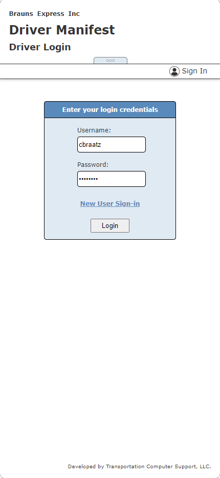 *Figure 2.0: Login Credentials*

#### Delivery Verification
After login, drivers encounter a popup requesting the **delivery date and power unit**. The portal verifies that the provided information matches an active delivery manifest. Only valid and authorized deliveries are displayed.
This functionality supports both real-time updates and retrospective data edits, accommodating operational changes or driver reassignments.

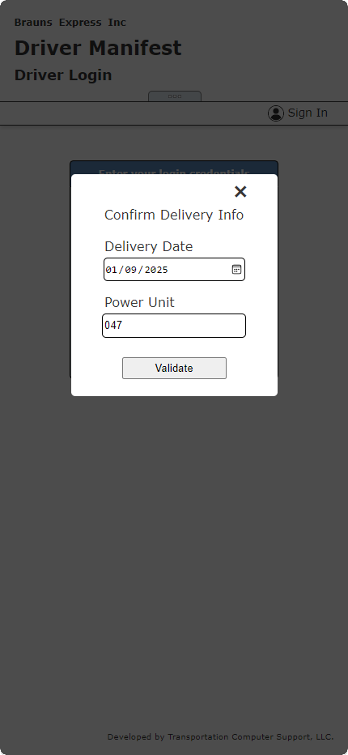 *Figure 2.1: Delivery Verification*

This login portal exemplifies a robust, user-centric design, balancing accessibility and security while addressing the dynamic needs of the trucking logistics industry.

## Delivery Manifest
Once a driver's credentials and delivery information (date and power unit) are verified, the application presents an interactive **delivery manifest**. This manifest contains a comprehensive list of the driver’s assigned deliveries, categorized into **undelivered** and **delivered** shipments. Undelivered deliveries are prioritized and displayed at the top for quick access, while delivered entries appear below.

### Interactive Table Functionality
The manifest is designed to be highly interactive, enhancing usability across various devices:

- Entry Navigation: Drivers can tap (on mobile) or click (on tablets/PCs) any row in the table to access detailed delivery information for editing.
- Dynamic Columns:
    - On mobile devices held vertically, the table dynamically truncates non-essential fields to optimize the display for smaller screens.
    - When the device is rotated horizontally or the app is accessed on a tablet/PC, additional columns are rendered, providing a more detailed overview of delivery data.

This adaptive design ensures a seamless user experience, regardless of device or orientation, while maintaining access to critical delivery information.

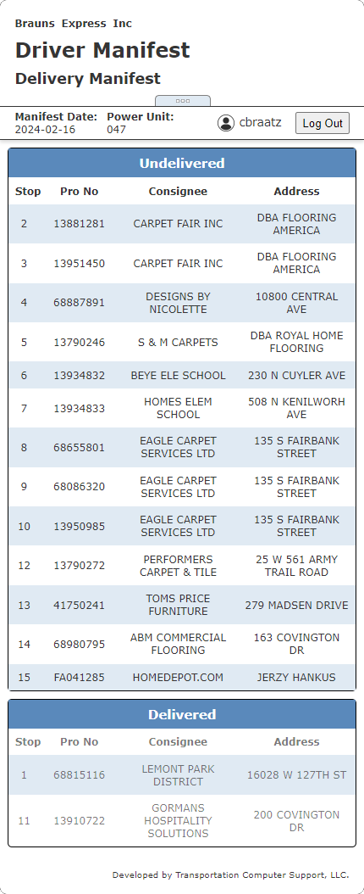 *Figure 3.0: Delivery Manifest*

## Expanded Delivery Information
By selecting a row in the manifest, users navigate to a detailed view of the chosen delivery. This expanded interface allows drivers to review and edit all associated delivery information, ensuring accuracy and flexibility in maintaining records.

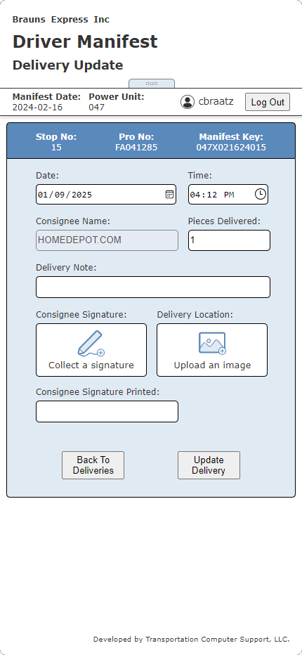 *Figure 3.1: Expanded Delivery Information*

The **Expanded Delivery Information** page empowers drivers to input delivery details through text and number fields, while leveraging custom-built widgets for advanced functionalities like signature collection and image capture.

### Signature and Image Management
- Signature Collection: Drivers can use the signature widget to digitally sign for deliveries directly within the app.
- Image Capture and Thumbnails:
    - Captured images are dynamically rendered as thumbnails immediately upon upload.
    - Thumbnails double as interactive buttons, allowing drivers to replace existing images with new uploads.

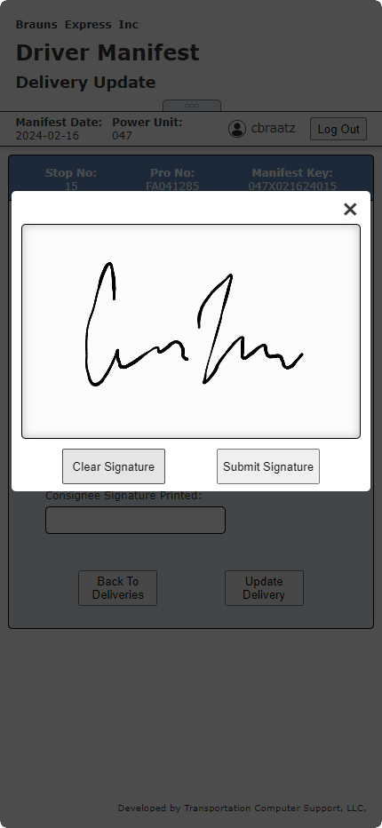 *Figure 3.2: Signature Capture*

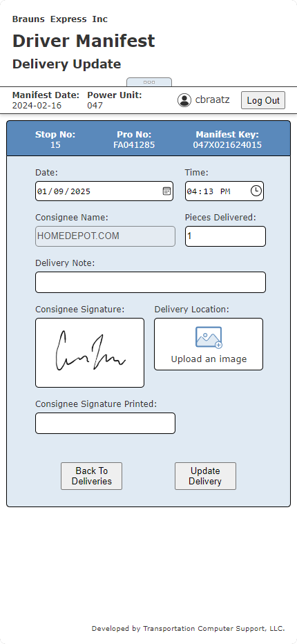 *Figure 3.3: Image Thumbnails*

### Image Storage and Retrieval Workflow
- Captured images are uploaded and saved to a predefined file path on the server.
- The file path, rather than the image itself, is stored in the database for efficient record management.
- Backend logic handles image retrieval by accepting requests with valid file paths and returning the corresponding image for rendering on subsequent accesses.

This system ensures efficient image storage while enabling seamless and secure image handling across client and server interactions. On subsequent visits to a completed delivery, the driver has the option to *undeliver* or reset a delivery to its original status prior to editing.

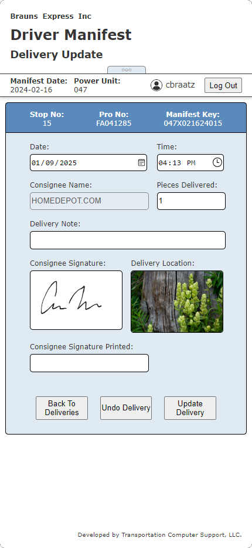 *Figure 3.4: Post-Delivery Interface*

## Visual Feedback for Database Changes
The application provides custom graphic icons and specific feedback messages to visually confirm the outcome of database interactions. Enhancing the user experience by communicating the status of each operation, clearly and effectively.

### Success Icons 
Displayed for successful database updates, ensuring users receive immediate confirmation.

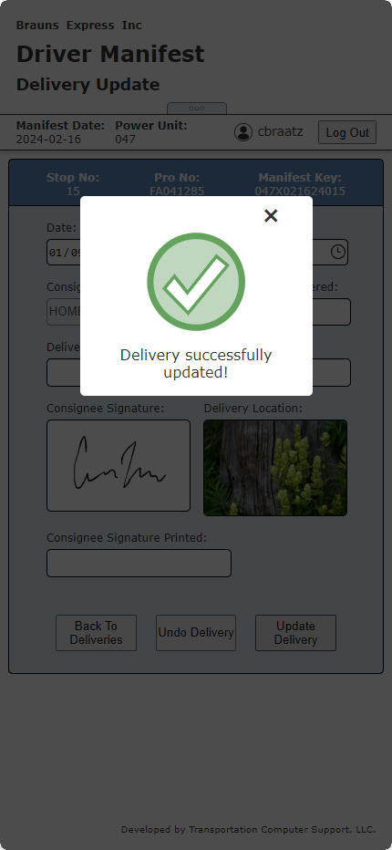 *Figure 3.5: Success Iconography*

### Error Icons
Highlight failed requests with accompanying messages to guide corrective actions.

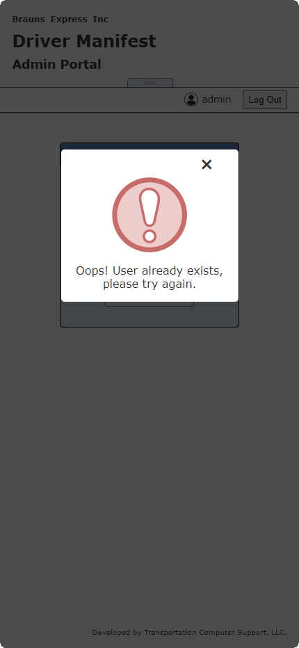 *Figure 3.6: Fail Iconography*

### Validation Icons
Indicate invalid or missing inputs for required fields, prompting users to address errors before proceeding.

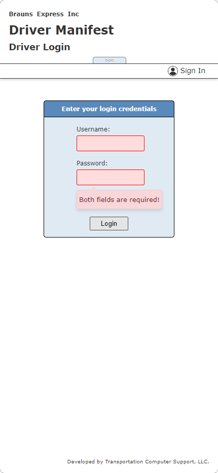 *Figure 3.7: Form/Field Validation*

## Administrative Portal
Administrative users with specific credentials are redirected to an Admin Menu upon successful login. The portal provides a suite of tools for managing user accounts and application settings.

### Admin Menu
The main menu presents three options:
1) Add New Users
2) Change/Remove Existing Users
3) Edit Active Company Name

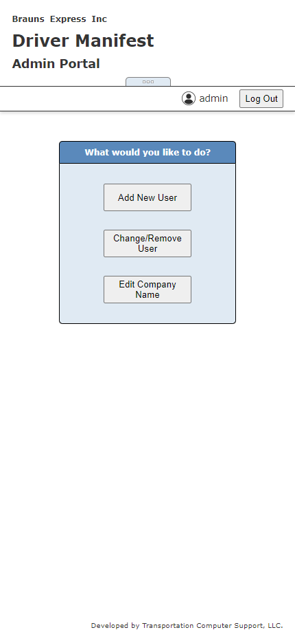 *Figure 4.1: Admin Menu*

### Add User Interface
Admins can create new user accounts by specifying a username and assigning a power unit. Validations ensure that required fields are not left empty.

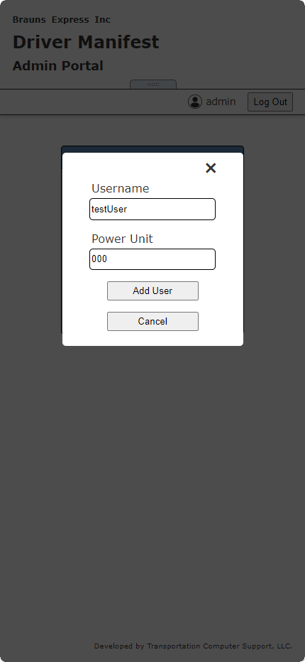 *Figure 4.2: Add User Interface*

### Edit/Remove Existing Users
Admins can search for existing users through a **username** search field. Upon validation, the user’s current details, including **username, password, and power unit**, are displayed for editing or removal.

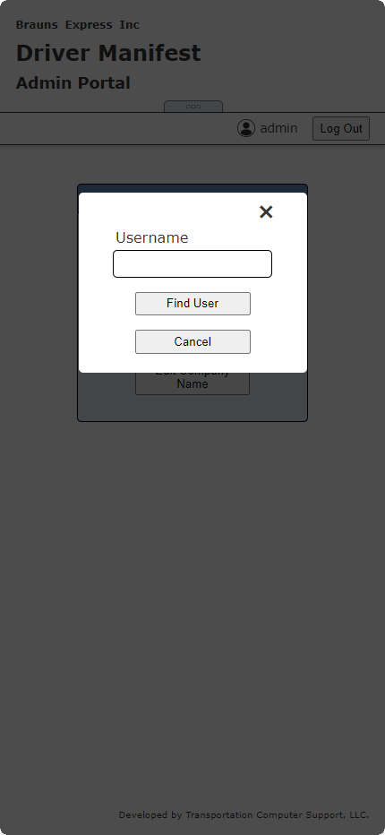 *Figure 4.3: Find User Interface*

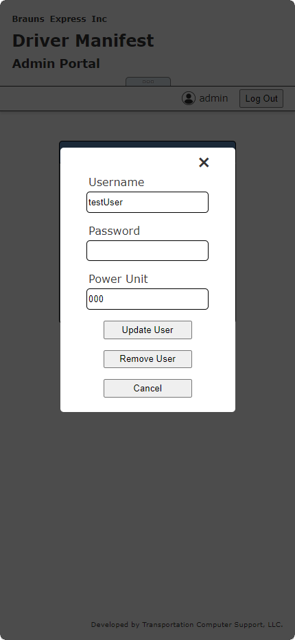 *Figure 3.4: Change/Remove User Interface*

### Company Name Configuration
The portal also allows admins to update the active company name used across the application. This ensures the app aligns with the current operational context.

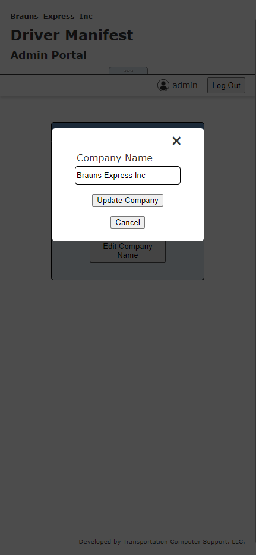 *Figure 4.4: Company Name Interface*

This administrative portal provides flexibility and control, enabling efficient management of user accounts and key application settings.
