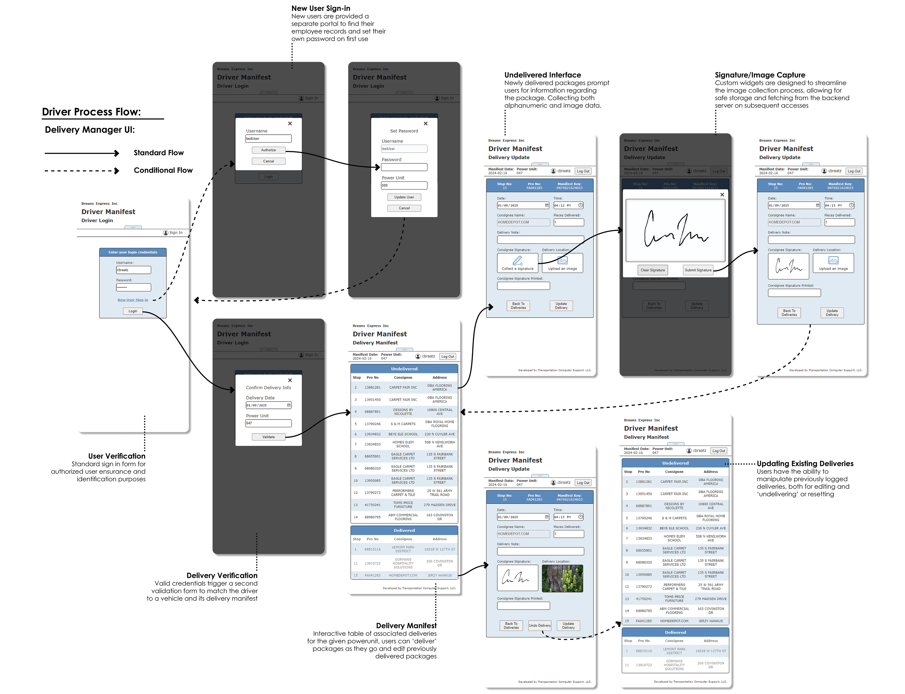

# Delivery Validation Microservice

## Project Overview

This repository contains a dedicated microservice focused on **delivery validation, manifest interaction, and real-time delivery updates** for a trucking logistics company. It forms a crucial part of a larger, microservices-based web application designed to streamline delivery tracking and driver log management.

Built with a scalable **.NET backend (C#)**, this service is responsible for securely handling database transactions related to delivery records. It interacts with the central delivery manifest to provide drivers with the ability to view, edit, and update their assigned deliveries directly from their mobile devices.

This microservice is designed to be highly efficient and robust, contributing to the overall system's ability to compile and present delivery data for existing backend systems, facilitating live tracking capabilities for fleet management and real-time logistics optimization.

## Architecture and Integration

This microservice operates within a broader ecosystem of services, notably interacting with a separate **Login Portal Microservice**.

* **Authentication & Authorization:** This service does *not* handle user login directly. Instead, it relies on a validated session established by the Login Portal Microservice. Requests to this service's protected endpoints expect a valid JWT (JSON Web Token) to be present, which is issued and managed by the Login Portal.
* **Token Validation:** This microservice includes its own `TokenService` to validate incoming JWTs against a shared secret key and configuration. This allows it to independently verify the authenticity and authorization of requests, including refreshing access tokens if the refresh token is valid and needs to be renewed.
* **Data Interaction:** It directly interfaces with the delivery manifest database, ensuring that all delivery-related operations are performed securely and efficiently.

## Core Functionality & Workflow

This microservice powers the driver's interface for managing deliveries.

### UX/UI Workflow (Driver Process Flow)
The following figures illustrate the driver's interaction with the components managed by this microservice.

 *Figure 1.0: Driver Interface*

### Delivery Manifest Interaction

Once a driver's session is validated (by the Login Portal) and their delivery information (date and power unit) is confirmed, this microservice serves the interactive **delivery manifest**. This manifest displays a comprehensive list of the driver’s assigned deliveries, categorized into **undelivered** and **delivered** shipments. Undelivered deliveries are prioritized and displayed at the top for quick access, while delivered entries appear below.

#### Interactive Table Functionality
The manifest is designed to be highly interactive, enhancing usability across various devices:

* **Entry Navigation:** Drivers can tap (on mobile) or click (on tablets/PCs) any row in the table to access detailed delivery information for editing.
* **Dynamic Columns:**
    * On mobile devices held vertically, the table dynamically truncates non-essential fields to optimize the display for smaller screens.
    * When the device is rotated horizontally or the app is accessed on a tablet/PC, additional columns are rendered, providing a more detailed overview of delivery data.

This adaptive design ensures a seamless user experience, regardless of device or orientation, while maintaining access to critical delivery information.

 *Figure 3.0: Delivery Manifest*

### Expanded Delivery Information & Updates

By selecting a row in the manifest, users navigate to a detailed view of the chosen delivery. This expanded interface allows drivers to review and edit all associated delivery information, ensuring accuracy and flexibility in maintaining records. This microservice processes all updates submitted from this view.

 *Figure 3.1: Expanded Delivery Information*

The **Expanded Delivery Information** page empowers drivers to input delivery details through text and number fields, while leveraging custom-built widgets for advanced functionalities like signature collection and image capture.

#### Signature and Image Management
This microservice handles the backend logic for:
* **Signature Collection:** Processing digital signatures captured within the app.
* **Image Capture and Thumbnails:** Receiving and storing captured images, and managing their association with delivery records.
    * Captured images are dynamically rendered as thumbnails immediately upon upload.
    * Thumbnails double as interactive buttons, allowing drivers to replace existing images with new uploads.

 *Figure 3.2: Signature Capture*

 *Figure 3.3: Image Thumbnails*

#### Image Storage and Retrieval Workflow
This microservice implements the following workflow for images:
* Captured images are uploaded to and saved at a predefined file path on the server where this service is hosted.
* The file path, rather than the image itself, is stored in the database for efficient record management.
* Backend logic within this service handles image retrieval by accepting requests with valid file paths and returning the corresponding image data for rendering on client-side subsequent accesses.

This system ensures efficient image storage while enabling seamless and secure image handling across client and server interactions. On subsequent visits to a completed delivery, the driver has the option to *undeliver* or reset a delivery to its original status prior to editing, with this microservice processing those state changes.

 *Figure 3.4: Post-Delivery Interface*

## Visual Feedback for Database Changes

This microservice provides the data and status updates that drive the client-side visual feedback, using custom graphic icons and specific feedback messages to visually confirm the outcome of database interactions. This enhances the user experience by communicating the status of each operation, clearly and effectively.

### Success Icons
Processed responses from this service trigger success icons for successful database updates, ensuring users receive immediate confirmation.

 *Figure 3.5: Success Iconography*

### Error Icons
Failed requests handled by this service result in error icons with accompanying messages to guide corrective actions.

 *Figure 3.6: Fail Iconography*

### Validation Icons
Input validation performed by this service (or related client-side logic) contributes to displaying icons indicating invalid or missing inputs for required fields, prompting users to address errors before proceeding.

 *Figure 3.7: Form/Field Validation*

---